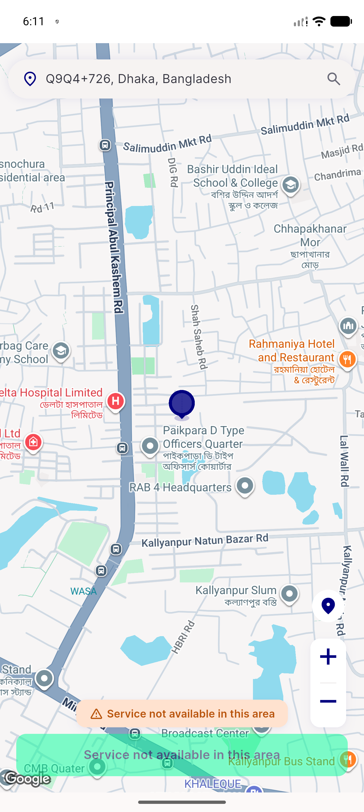
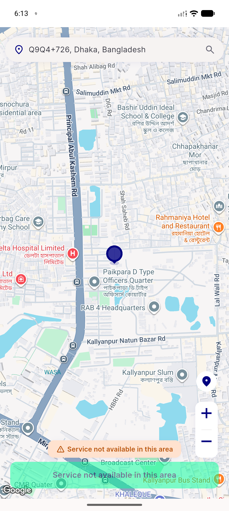
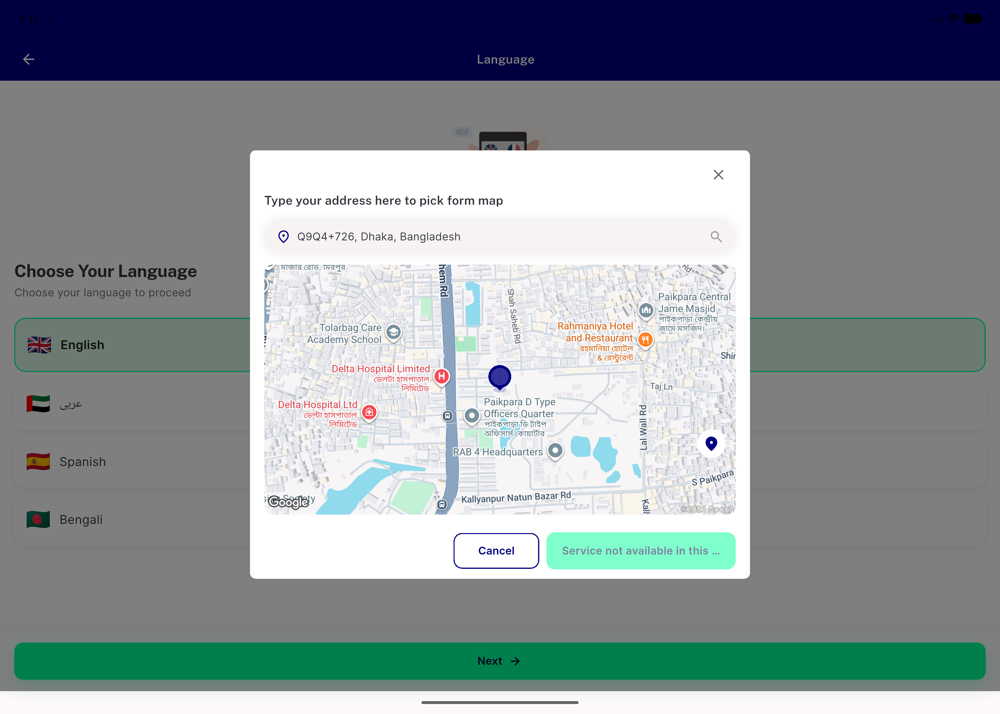
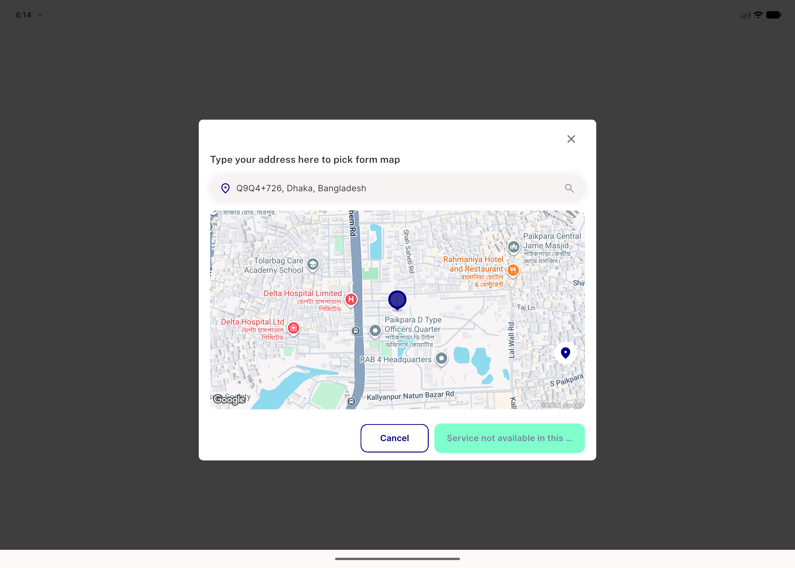

# QA Evidence — NEARS-2794

**QA FAIL — AC2 & AC3-desktop broken: desktop cold-launch/relaunch auto-fetches getCurrentLocation() (route:null bug in navigateToLocationScreen desktop branch, unrelated to NEARS-2794's own fix); AC1/AC3-mobile PASS**

**4 screenshot(s).** Click any thumbnail for full resolution.

<table>
<tr>
<td align="center" width="33%"> ac1 mobile cold launch pickmap</td>
<td align="center" width="33%"> ac3 mobile guest relaunch pickmap</td>
<td align="center" width="33%"> bug ac2 desktop autofetch fired</td>
</tr>
<tr>
<td align="center" width="33%"> bug ac3 desktop guestrelaunch autofetch fired</td>
</tr>
</table>

### Other artifacts
- [`bug-ac2-desktop-autofetch-fired.log`](bug-ac2-desktop-autofetch-fired.log)
- [`bug-ac3-desktop-guestrelaunch-autofetch-fired.log`](bug-ac3-desktop-guestrelaunch-autofetch-fired.log)

---
*From `nears/docs/qa-evidence/NEARS-2794/` · public-repo scrub policy (no live secrets; verified clean).*
