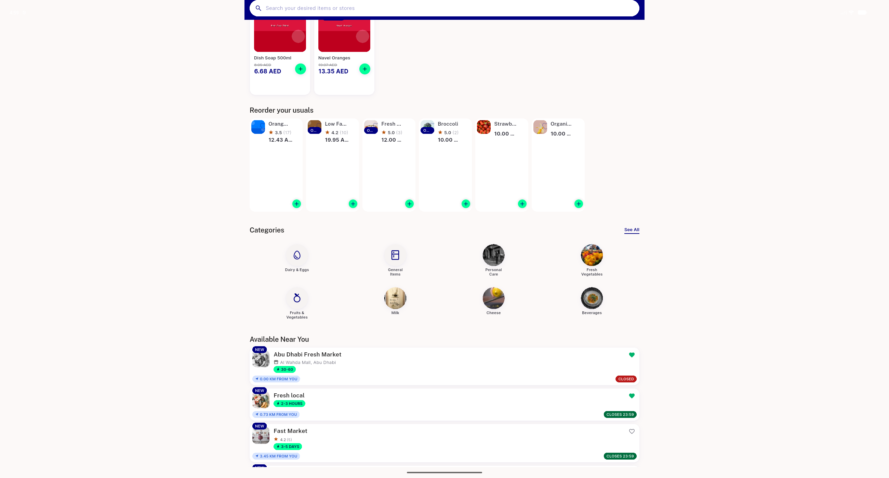
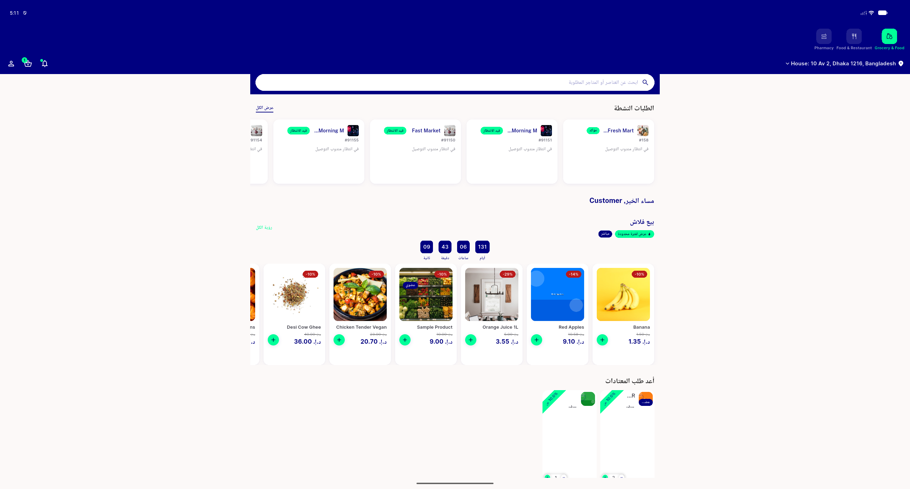
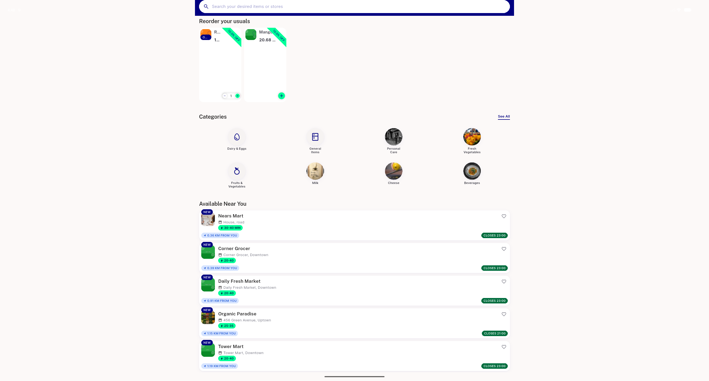

# QA Evidence — NEARS-2803

**Delta re-QA fix-cycle 3: PASS on Finding A/B re-verify; rated-item list_rating_row overflow REPRODUCED live (pre-existing, out of scope)**

**4 screenshot(s).** Click any thumbnail for full resolution.

<table>
<tr>
<td align="center" width="33%"> bug list rating row overflow rated in cart</td>
<td align="center" width="33%"> cycle3 ar rtl narrow rail incart</td>
<td align="center" width="33%"> cycle3 en narrow rail topalign</td>
</tr>
<tr>
<td align="center" width="33%"> cycle3 rated item before add</td>
</tr>
</table>

### Other artifacts
- [`bug-list-rating-row-overflow-rated-in-cart.log`](bug-list-rating-row-overflow-rated-in-cart.log)

---
*From `nears/docs/qa-evidence/NEARS-2803/` · public-repo scrub policy (no live secrets; verified clean).*
