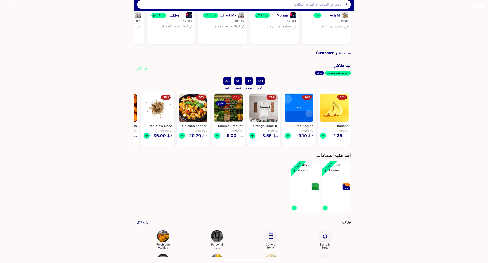
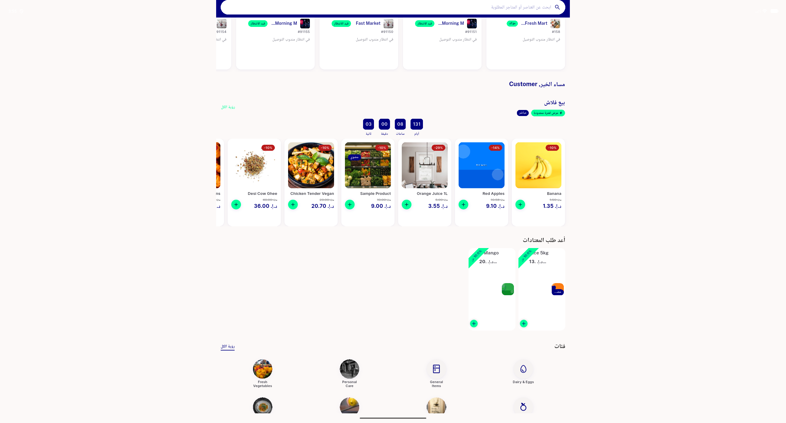
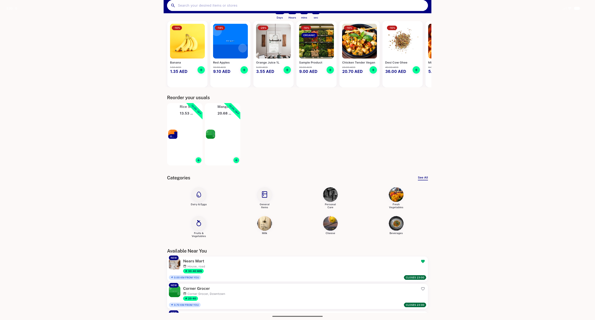
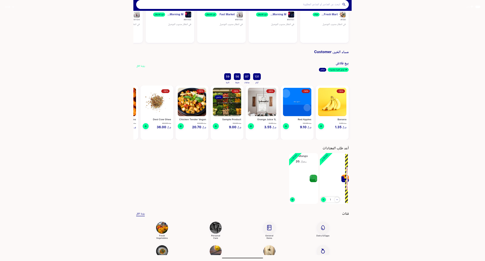
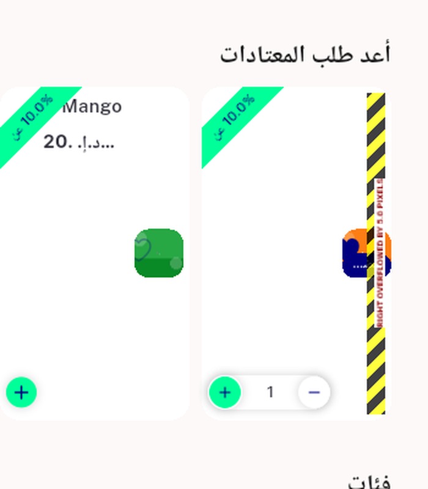
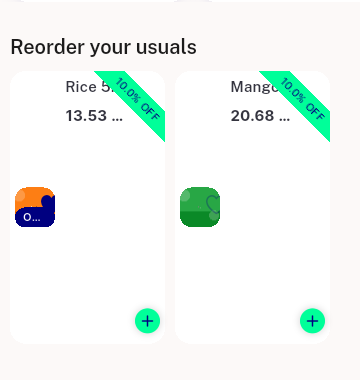

# QA Evidence — NEARS-2803

**PASS — AC1/AC2/AC3 + AR/RTL load-bearing check demonstrated live; 1 in-scope task_bug (in-cart overflow, pre-disclosed non-blocking), 1 polish task_bug (vertical gap), 1 unrelated regression_bug found**

**8 screenshot(s).** Click any thumbnail for full resolution.

<table>
<tr>
<td align="center" width="33%"> ac ar rtl desktop 13x</td>
<td align="center" width="33%"> ac ar rtl desktop clean</td>
<td align="center" width="33%"> ac1 desktop reorder usuals no overflow</td>
</tr>
<tr>
<td align="center" width="33%"> ar 13x crop</td>
<td align="center" width="33%"> bug in cart overflow ar desktop</td>
<td align="center" width="33%"> bug in cart overflow crop</td>
</tr>
<tr>
<td align="center" width="33%"> reorder crop zoom</td>
<td align="center" width="33%"> reorder crop</td>
</tr>
</table>

### Other artifacts
- [`bug-reorder-rail-absent-after-midsession-login.xml`](bug-reorder-rail-absent-after-midsession-login.xml)
- [`reorder-rail-dump.xml`](reorder-rail-dump.xml)

---
*From `nears/docs/qa-evidence/NEARS-2803/` · public-repo scrub policy (no live secrets; verified clean).*
