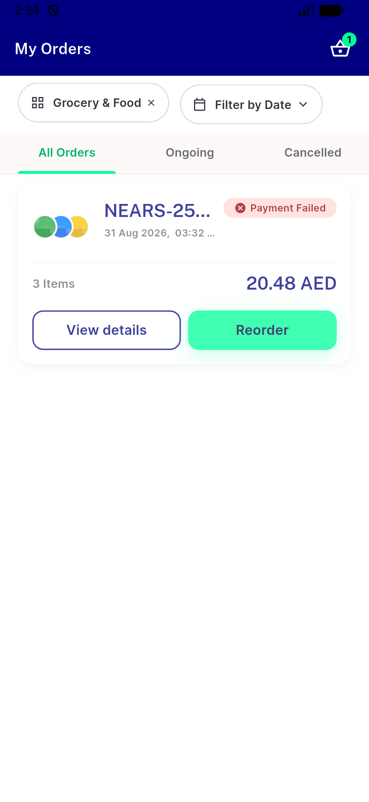
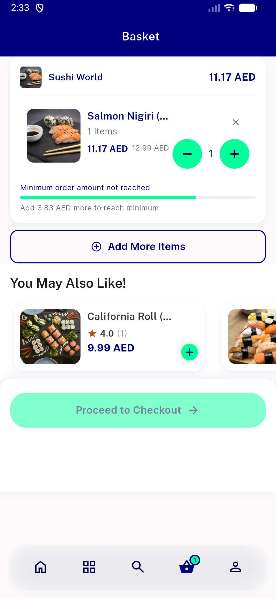

# QA Evidence — NEARS-2804

**FAIL - AC4 double [FAIL] log confirmed live; AC1/2/3/5 pass**

**2 screenshot(s).** Click any thumbnail for full resolution.

<table>
<tr>
<td align="center" width="33%"> ac2 error snackbar</td>
<td align="center" width="33%"> ac3 cart unchanged</td>
</tr>
</table>

---
*From `nears/docs/qa-evidence/NEARS-2804/` · public-repo scrub policy (no live secrets; verified clean).*
