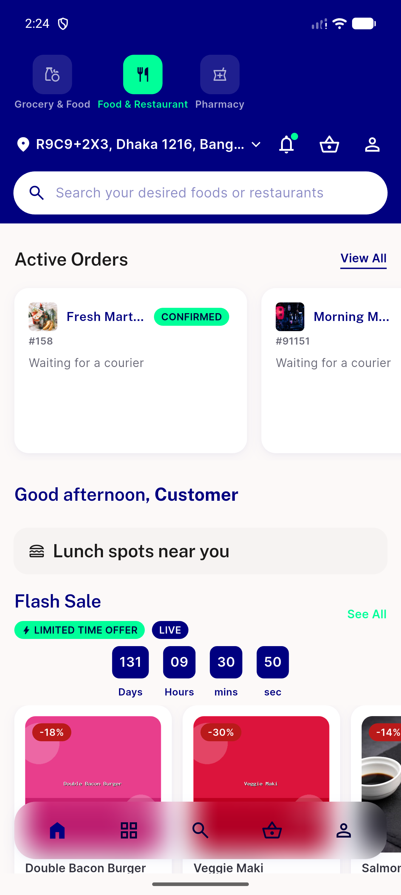

# QA Evidence — NEARS-2805

**PASS - basicCampaign null-data guard verified live (widget-test falsifiable proof + device regression sweep), no regressions**

**1 screenshot(s).** Click any thumbnail for full resolution.

<table>
<tr>
<td align="center" width="33%"> regression home module food</td>
</tr>
</table>

### Other artifacts
- [`ac1-ac2-widget-test-postfix-green.log`](ac1-ac2-widget-test-postfix-green.log)
- [`automated-backstop-helper-suite.log`](automated-backstop-helper-suite.log)

---
*From `nears/docs/qa-evidence/NEARS-2805/` · public-repo scrub policy (no live secrets; verified clean).*
