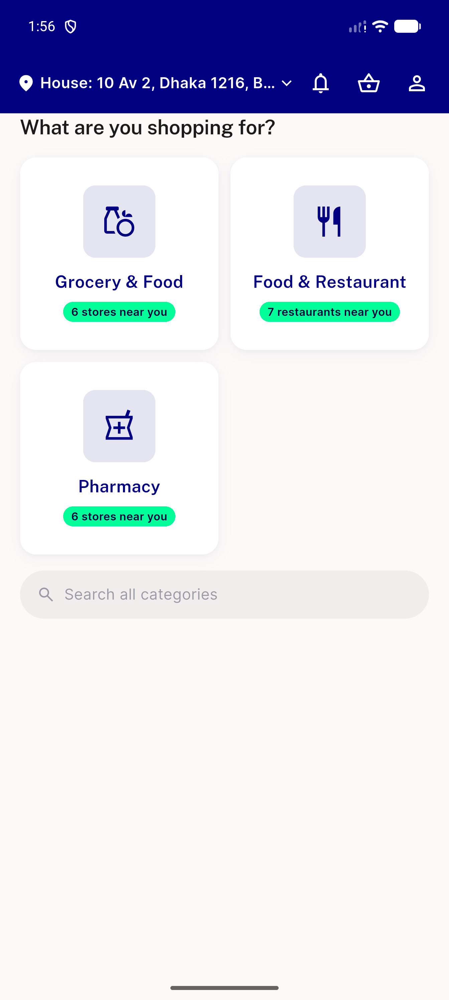
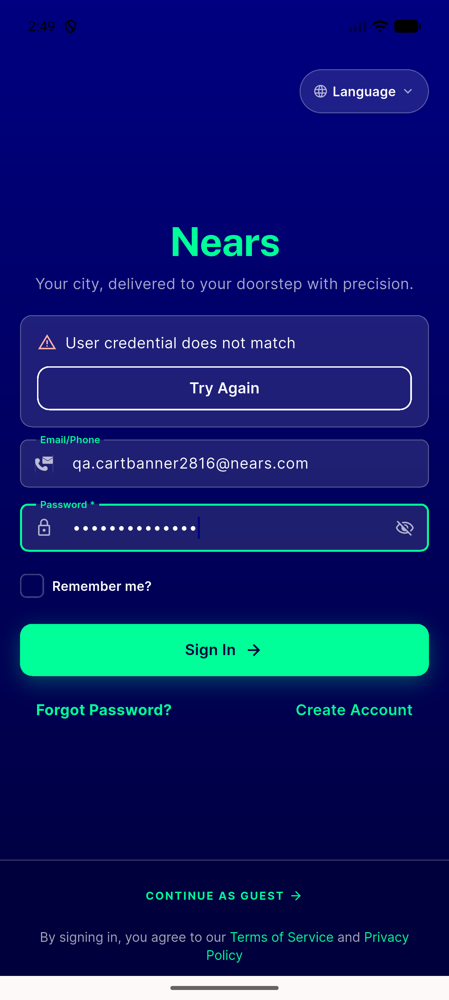
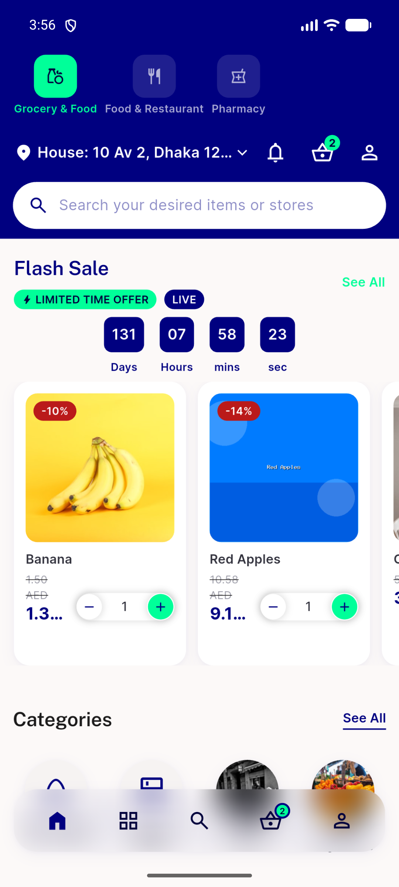

# QA Evidence — NEARS-2816

**Delta re-QA fix-cycle2 (final): FAIL — banner STILL never renders live (3 consecutive cycles); TB2 Menu-tab gap claim independently REFUTED; exception-message class independently corroborated via pinned SDK**

**3 screenshot(s).** Click any thumbnail for full resolution.

<table>
<tr>
<td align="center" width="33%"> bug ac1 banner not rendered</td>
<td align="center" width="33%"> bug fix1 still not rendered</td>
<td align="center" width="33%"> bug fix2 still not rendered screenshot</td>
</tr>
</table>

### Other artifacts
- [`bug-ac1-banner-not-rendered-dump.xml`](bug-ac1-banner-not-rendered-dump.xml)
- [`bug-ac1-banner-not-rendered.log`](bug-ac1-banner-not-rendered.log)
- [`bug-fix1-still-not-rendered-dump.xml`](bug-fix1-still-not-rendered-dump.xml)
- [`bug-fix1-still-not-rendered.log`](bug-fix1-still-not-rendered.log)
- [`bug-fix2-still-not-rendered-dump.xml`](bug-fix2-still-not-rendered-dump.xml)
- [`bug-fix2-still-not-rendered.log`](bug-fix2-still-not-rendered.log)
- [`control-showcustomsnackbar-renders-logout-successful.xml`](control-showcustomsnackbar-renders-logout-successful.xml)

---
*From `nears/docs/qa-evidence/NEARS-2816/` · public-repo scrub policy (no live secrets; verified clean).*
