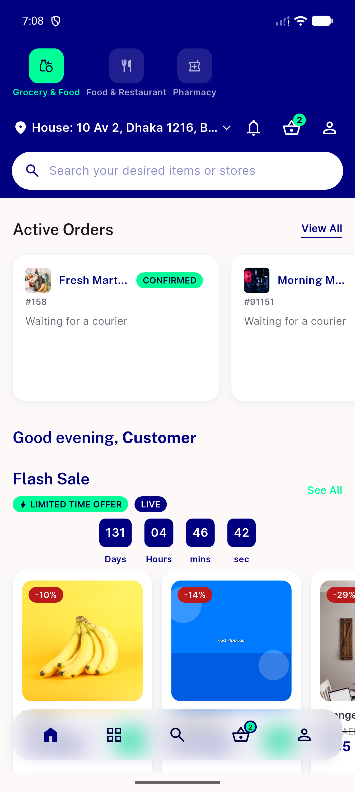

# QA Evidence — NEARS-2824

**FAIL: AC1 rail not mounted after mid-session login (backend correctly resolved zone/data); AC2/AC4 confirmed**

**1 screenshot(s).** Click any thumbnail for full resolution.

<table>
<tr>
<td align="center" width="33%"> bug rail not mounted after midsession login</td>
</tr>
</table>

### Other artifacts
- [`bug-rail-not-mounted-after-midsession-login.log`](bug-rail-not-mounted-after-midsession-login.log)
- [`fe-network-excerpt.log`](fe-network-excerpt.log)
- [`qa-2824-nofix-mount.xml`](qa-2824-nofix-mount.xml)

---
*From `nears/docs/qa-evidence/NEARS-2824/` · public-repo scrub policy (no live secrets; verified clean).*
