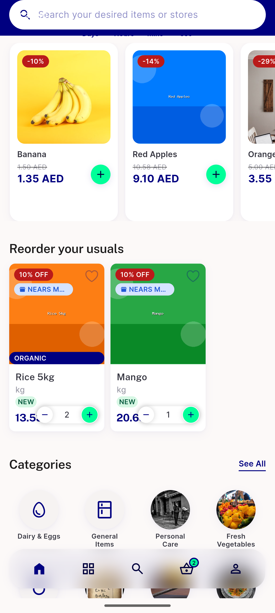
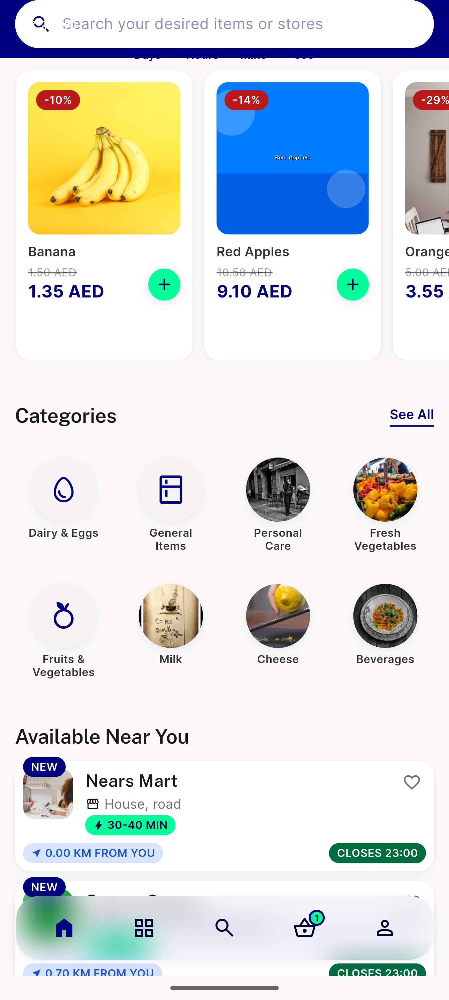
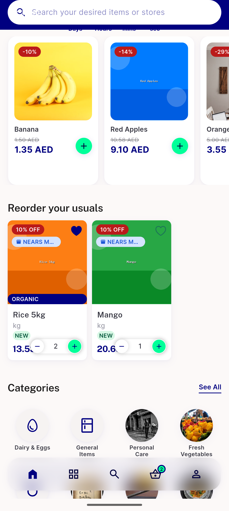
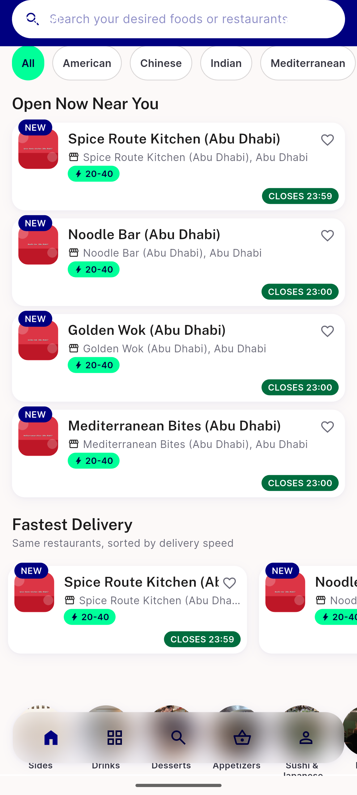

# QA Evidence — NEARS-2824

**Cycle 1 re-QA PASS: AC1 rail mounts on mid-session login (fixed), AC2/AC4 regression-clean, Food guest spot-check clean**

**4 screenshot(s).** Click any thumbnail for full resolution.

<table>
<tr>
<td align="center" width="33%"> ac1 rail mounted after login</td>
<td align="center" width="33%"> ac2 spotcheck rail hidden</td>
<td align="center" width="33%"> ac4 spotcheck restart rail</td>
</tr>
<tr>
<td align="center" width="33%"> food guest spotcheck</td>
</tr>
</table>

### Other artifacts
- [`dump_after_login.xml`](dump_after_login.xml)
- [`qa-2824-cycle1-ac1-mounted.xml`](qa-2824-cycle1-ac1-mounted.xml)
- [`qa-2824-cycle1-ac2-spotcheck.xml`](qa-2824-cycle1-ac2-spotcheck.xml)
- [`qa-2824-cycle1-ac4-spotcheck.xml`](qa-2824-cycle1-ac4-spotcheck.xml)
- [`qa-2824-cycle1-food-guest-spotcheck.xml`](qa-2824-cycle1-food-guest-spotcheck.xml)

---
*From `nears/docs/qa-evidence/NEARS-2824/` · public-repo scrub policy (no live secrets; verified clean).*
