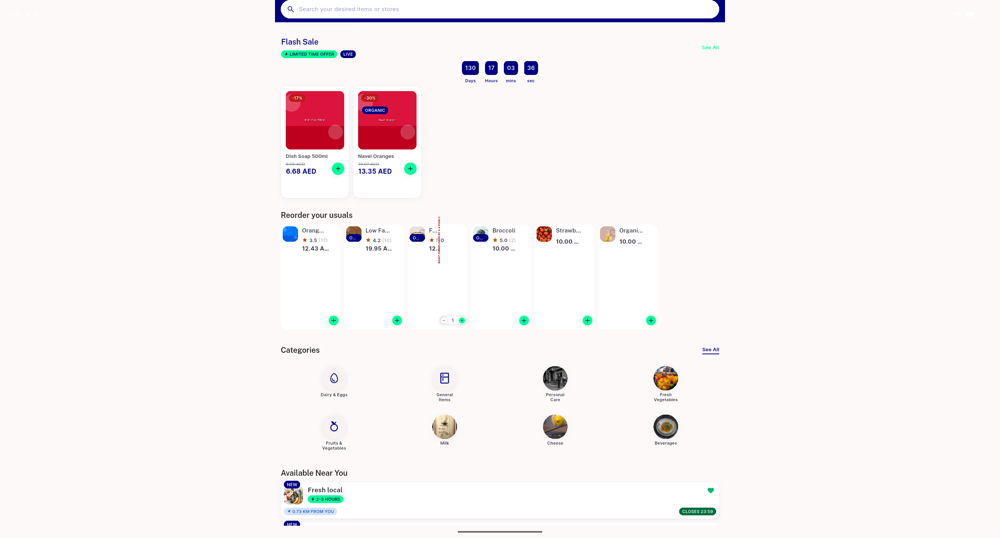
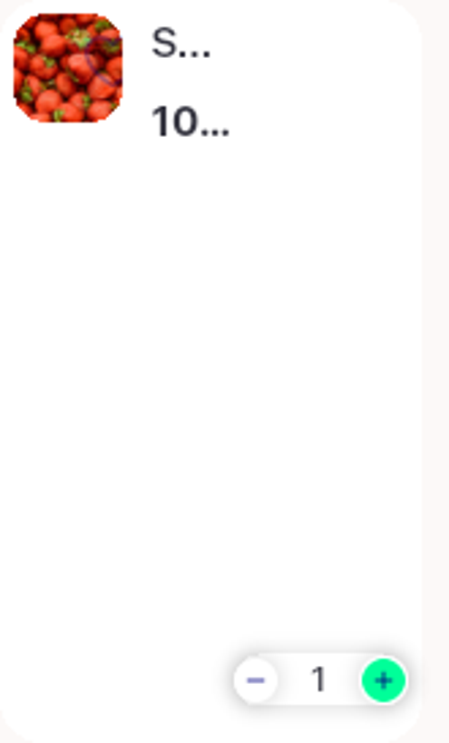

# QA Evidence — NEARS-2825

**PASS — narrow-rail in-cart rated overflow: 8.4px residual (tracked, ~8.7dp), ratingCount dropped, avgRating intact, RTL/1.3x/regressions clean, 21/21 automated**

**4 screenshot(s).** Click any thumbnail for full resolution.

<table>
<tr>
<td align="center" width="33%"> ac rtl narrow incart rated</td>
<td align="center" width="33%"> ac1 ac2 ac3 narrow incart rated</td>
<td align="center" width="33%"> ac1 ac2 ac3 overflow crop</td>
</tr>
<tr>
<td align="center" width="33%"> ac4 ratingcount0 regression instore</td>
</tr>
</table>

---
*From `nears/docs/qa-evidence/NEARS-2825/` · public-repo scrub policy (no live secrets; verified clean).*
