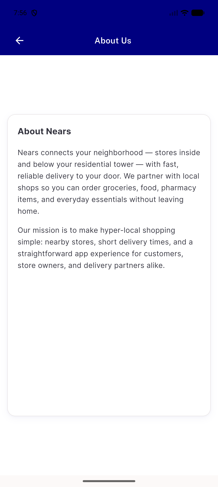
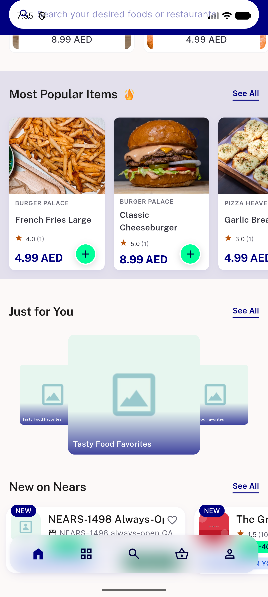
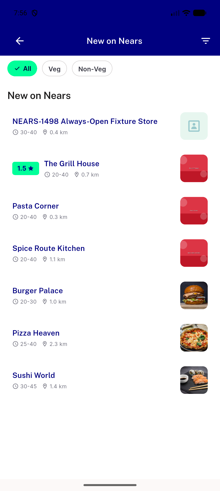

# QA Evidence — NEARS-2841

**PASS -- zero-caller GetPage route removal, verified live on emulator-5560**

**3 screenshot(s).** Click any thumbnail for full resolution.

<table>
<tr>
<td align="center" width="33%"> ac3 about us html page</td>
<td align="center" width="33%"> ac3 new on nears rail</td>
<td align="center" width="33%"> ac3 newstores allstorescreen</td>
</tr>
</table>

### Other artifacts
- [`bug-dls-golden-pixel-diff.log`](bug-dls-golden-pixel-diff.log)
- [`bug-facebook-oauth-error.log`](bug-facebook-oauth-error.log)

---
*From `nears/docs/qa-evidence/NEARS-2841/` · public-repo scrub policy (no live secrets; verified clean).*
