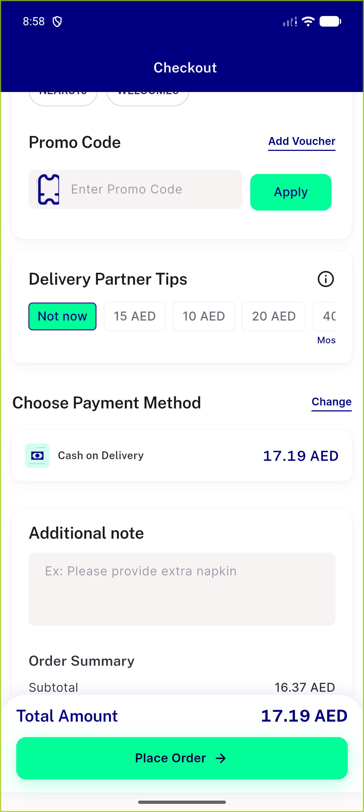
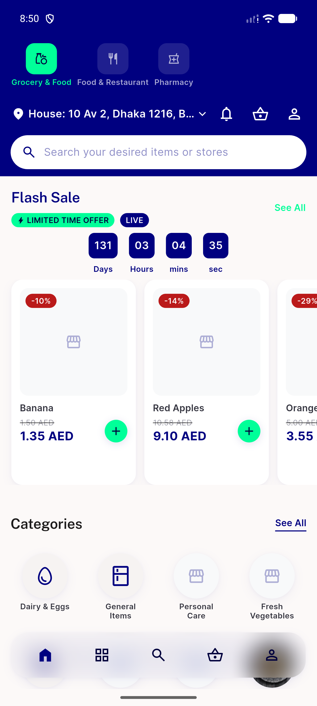
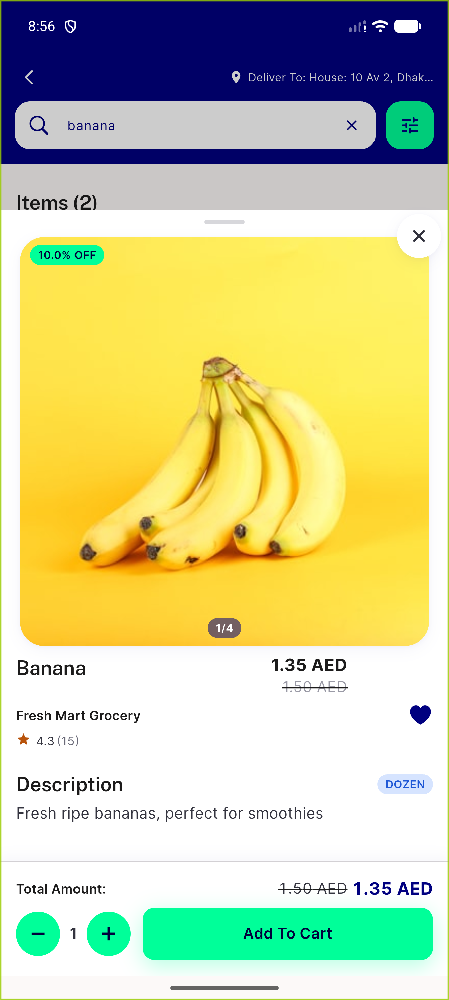
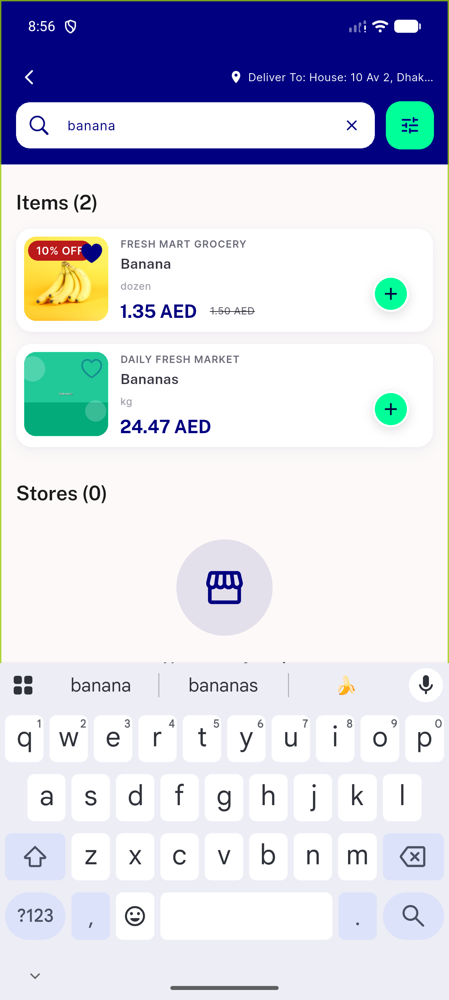
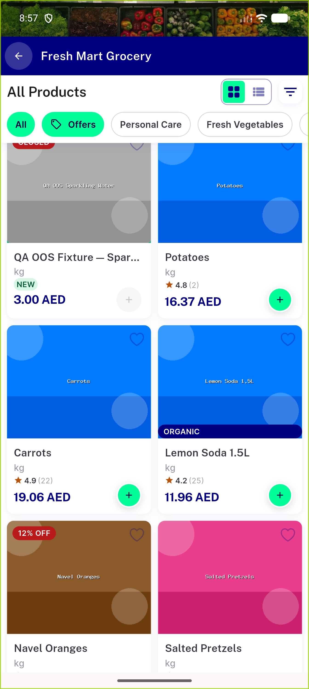

# QA Evidence — NEARS-2845

**PASS - orphan widget cleanup regression sweep clean, 2 pre-existing unrelated DLS golden failures flagged as regression-candidate**

**7 screenshot(s).** Click any thumbnail for full resolution.

<table>
<tr>
<td align="center" width="33%"> ac3 access location</td>
<td align="center" width="33%"> ac3 checkout payment</td>
<td align="center" width="33%"> ac3 home grocery</td>
</tr>
<tr>
<td align="center" width="33%"> ac3 item detail loaded</td>
<td align="center" width="33%"> ac3 registration</td>
<td align="center" width="33%"> ac3 search</td>
</tr>
<tr>
<td align="center" width="33%"> ac3 store detail</td>
</tr>
</table>

---
*From `nears/docs/qa-evidence/NEARS-2845/` · public-repo scrub policy (no live secrets; verified clean).*
