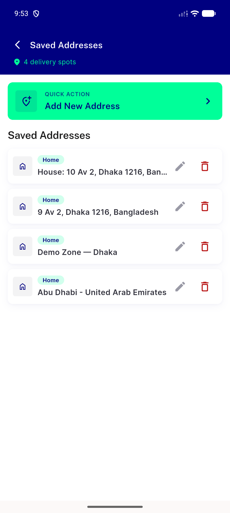
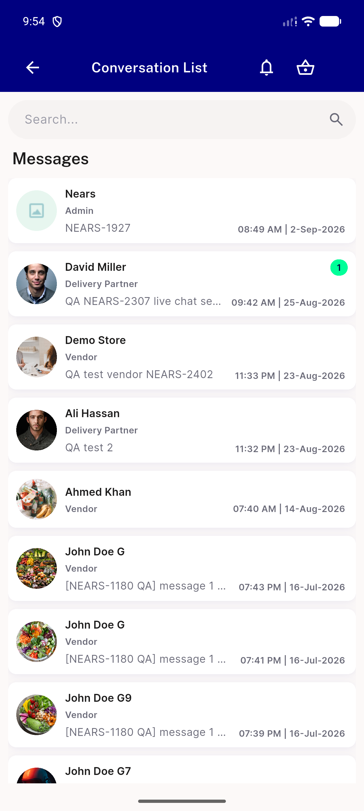
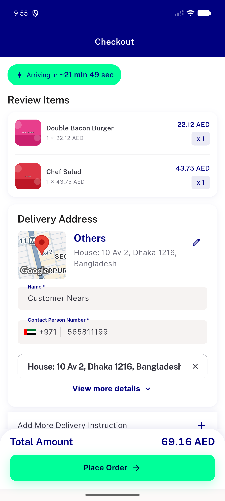
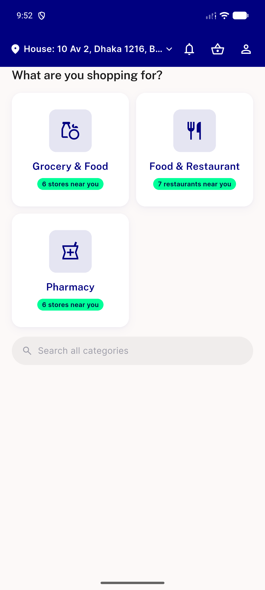
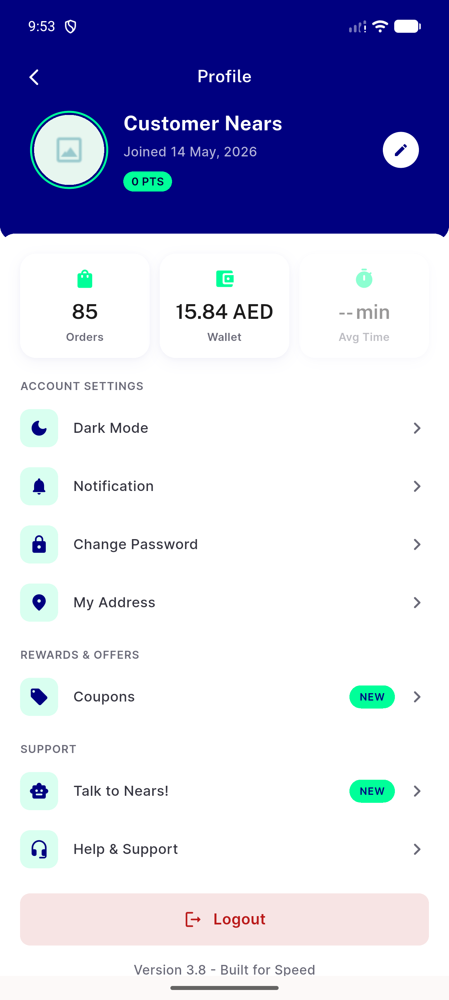
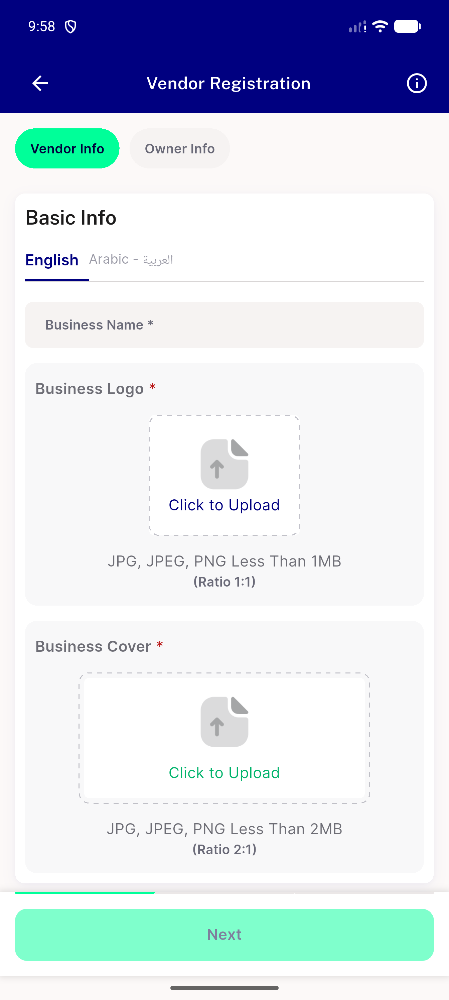

# QA Evidence — NEARS-2849

**PASS - dead Images.* constants + 7 unreferenced assets removed, verified clean across home/checkout/profile/chat/address + store-registration upload icon**

**6 screenshot(s).** Click any thumbnail for full resolution.

<table>
<tr>
<td align="center" width="33%"> address</td>
<td align="center" width="33%"> chat</td>
<td align="center" width="33%"> checkout</td>
</tr>
<tr>
<td align="center" width="33%"> home</td>
<td align="center" width="33%"> profile</td>
<td align="center" width="33%"> store registration upload</td>
</tr>
</table>

---
*From `nears/docs/qa-evidence/NEARS-2849/` · public-repo scrub policy (no live secrets; verified clean).*
