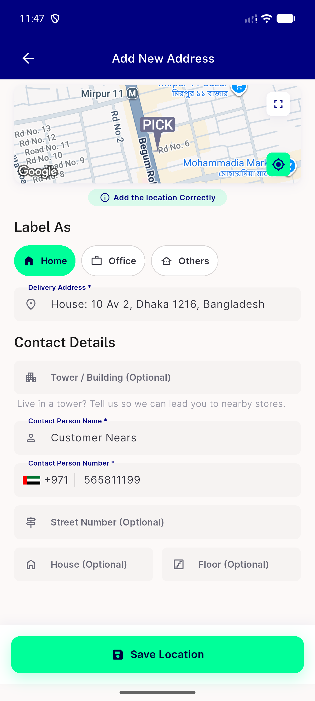

# QA Evidence — NEARS-2856

**PASS - taxi/rental dead-code cleanup, add-address label verified live**

**1 screenshot(s).** Click any thumbnail for full resolution.

<table>
<tr>
<td align="center" width="33%"> add address delivery label</td>
</tr>
</table>

### Other artifacts
- [`add_address_screen_dump.xml`](add_address_screen_dump.xml)
- [`bug-dls-golden-mismatch.log`](bug-dls-golden-mismatch.log)

---
*From `nears/docs/qa-evidence/NEARS-2856/` · public-repo scrub policy (no live secrets; verified clean).*
