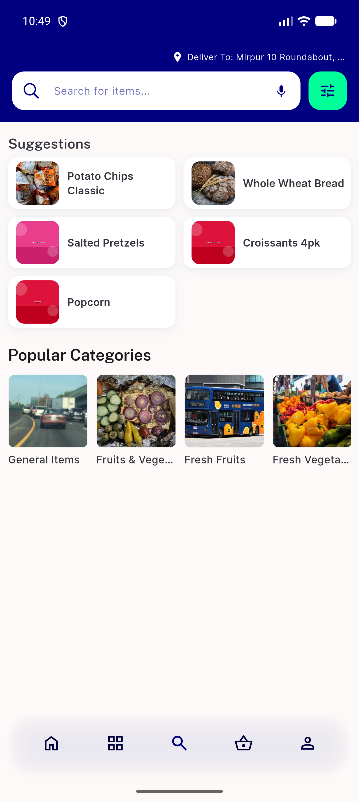
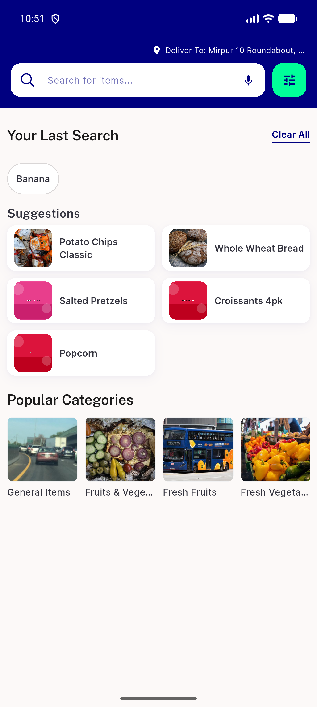
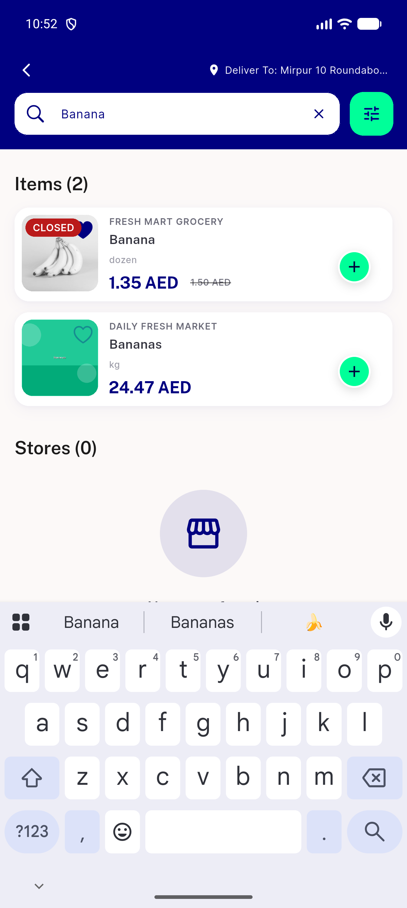
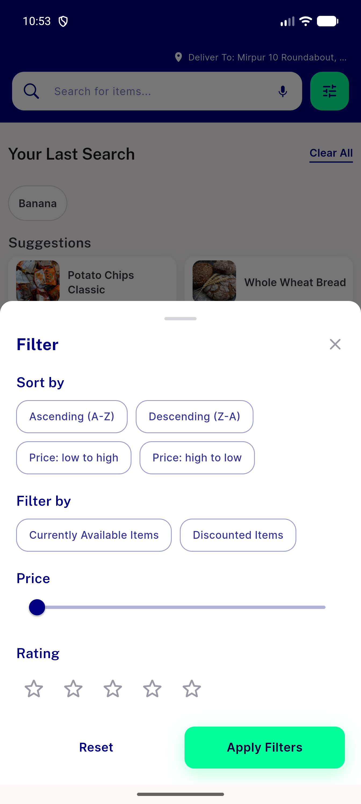
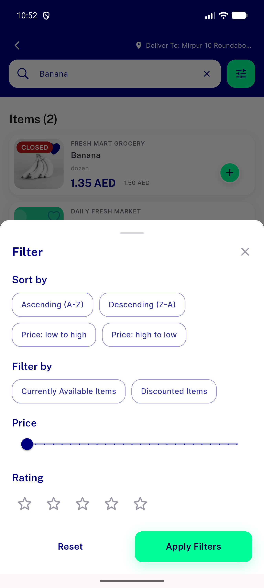

# QA Evidence — NEARS-2859

**PASS - doc-comment fix verified live, dashboard tab vs standalone /search idle+results both match, filter sheet unaffected**

**6 screenshot(s).** Click any thumbnail for full resolution.

<table>
<tr>
<td align="center" width="33%"> ac1 dashboard tab idle</td>
<td align="center" width="33%"> ac1 dashboard tab results</td>
<td align="center" width="33%"> ac1 standalone idle</td>
</tr>
<tr>
<td align="center" width="33%"> ac1 standalone results</td>
<td align="center" width="33%"> regression filter sheet dashboard tab</td>
<td align="center" width="33%"> regression filter sheet standalone</td>
</tr>
</table>

---
*From `nears/docs/qa-evidence/NEARS-2859/` · public-repo scrub policy (no live secrets; verified clean).*
