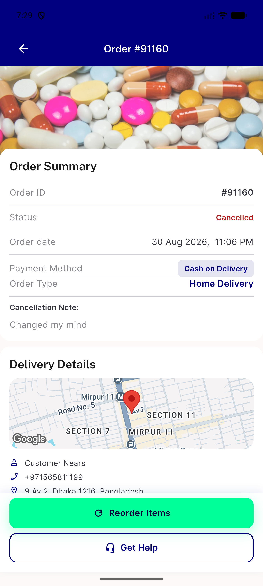
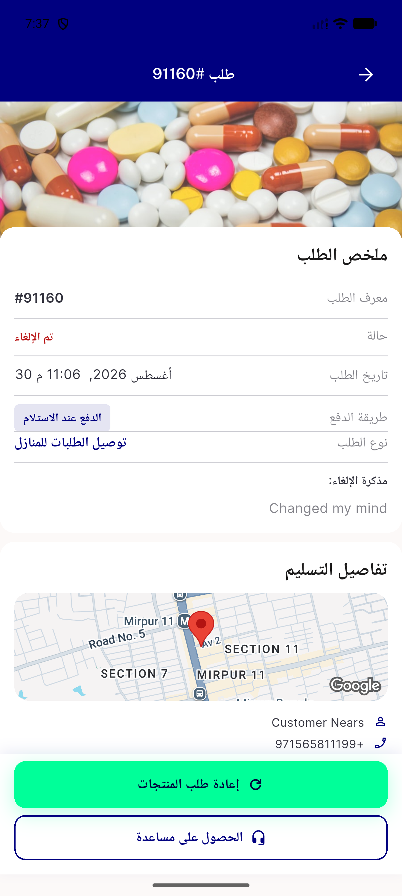
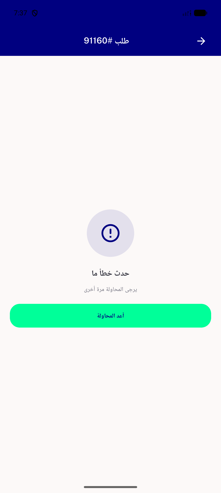
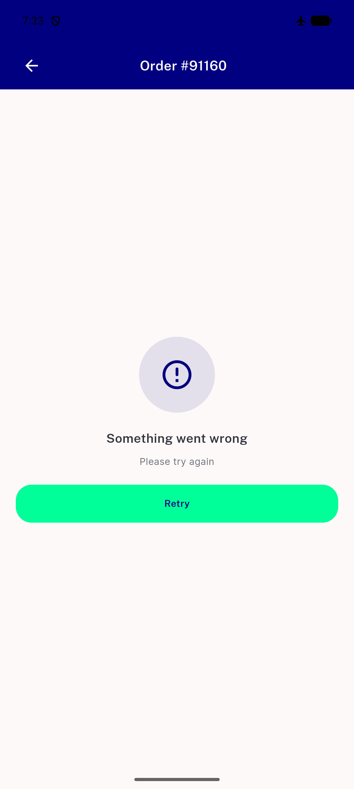
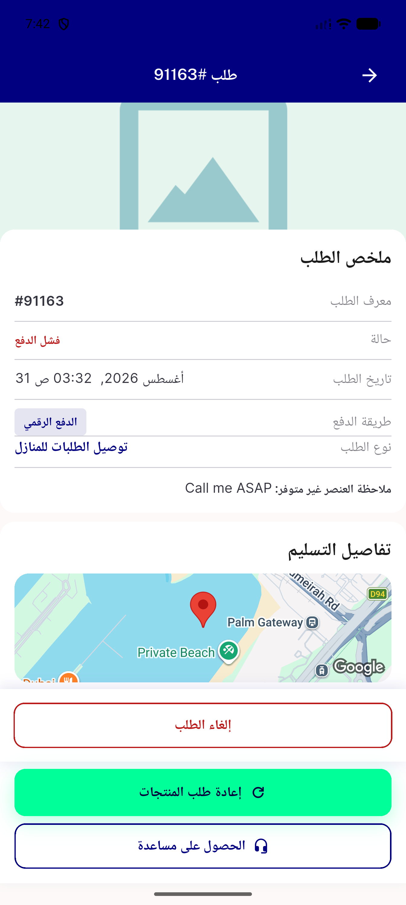
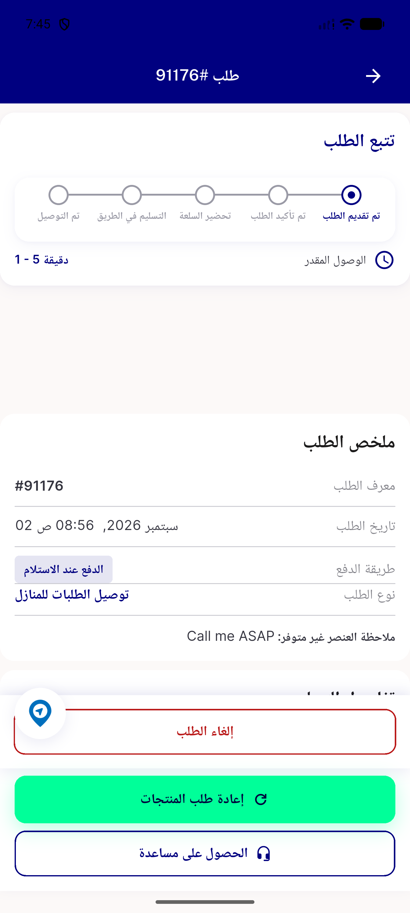

# QA Evidence — NEARS-2860

**PASS - NAppBar/NButton reskin + NErrorRetry + mobile red status-row regression fix, emulator-5556**

**6 screenshot(s).** Click any thumbnail for full resolution.

<table>
<tr>
<td align="center" width="33%"> ac1 ac2 ac4 order 91160 canceled en</td>
<td align="center" width="33%"> ac1 ac2 ac4 rtl order 91160 canceled ar</td>
<td align="center" width="33%"> ac3 nerrorretry ar</td>
</tr>
<tr>
<td align="center" width="33%"> ac3 nerrorretry en</td>
<td align="center" width="33%"> regression order 91163 failed status red ar</td>
<td align="center" width="33%"> regression order 91176 pending tracker no status row ar</td>
</tr>
</table>

---
*From `nears/docs/qa-evidence/NEARS-2860/` · public-repo scrub policy (no live secrets; verified clean).*
