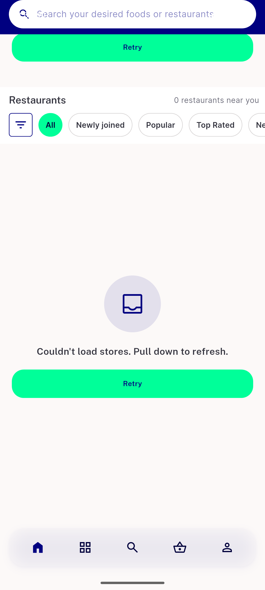
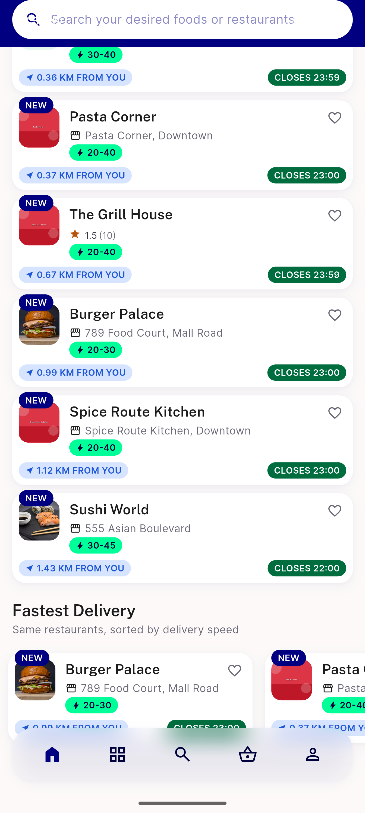

# QA Evidence — NEARS-2865

**PASS -- all-stores sliver retry AC1+AC2 demonstrated live (emulator-5554), 8/8 NoDataScreen callers regression-clean, flutter test 2/2 green**

**2 screenshot(s).** Click any thumbnail for full resolution.

<table>
<tr>
<td align="center" width="33%"> ac1 sliver retry cta</td>
<td align="center" width="33%"> ac2 retry success grid</td>
</tr>
</table>

---
*From `nears/docs/qa-evidence/NEARS-2865/` · public-repo scrub policy (no live secrets; verified clean).*
