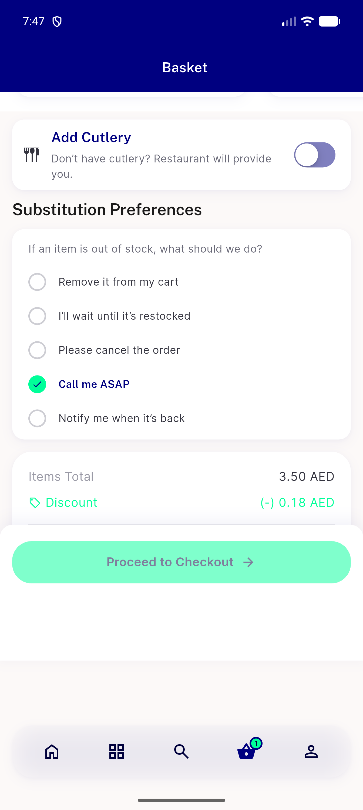
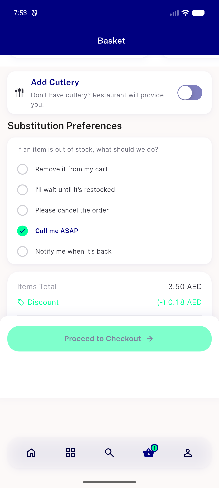
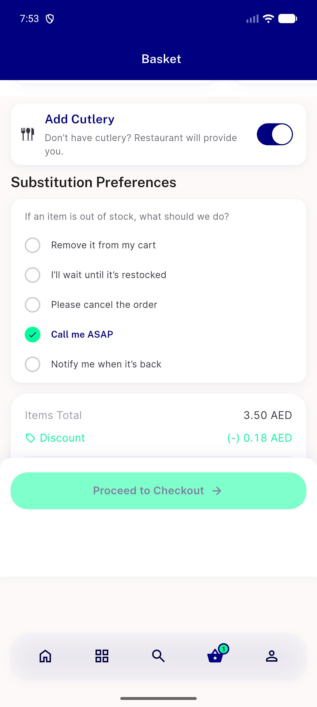
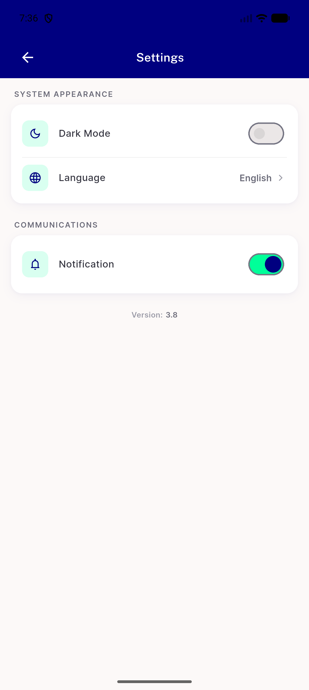
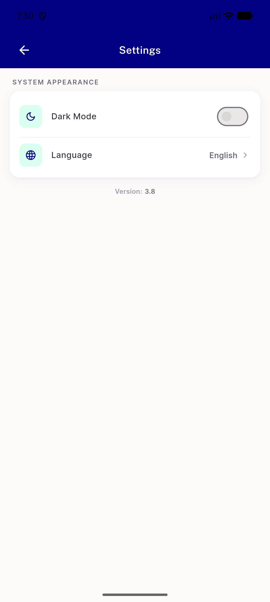
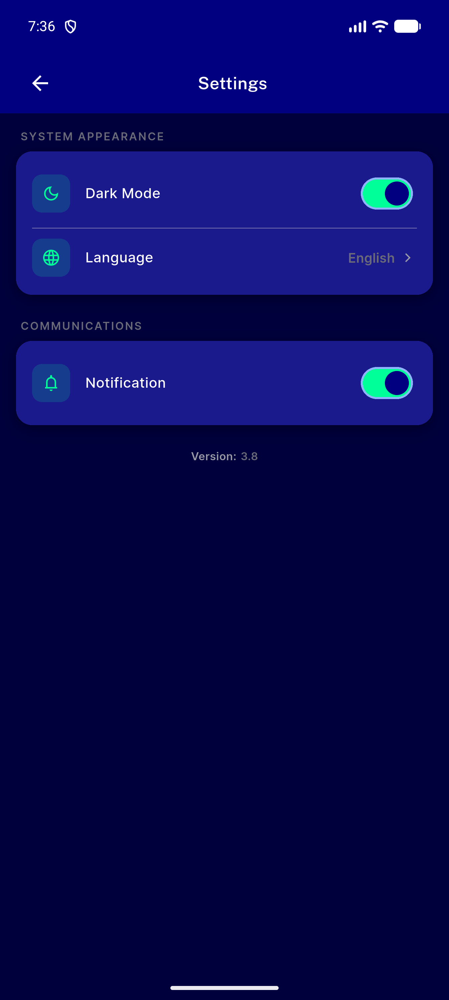
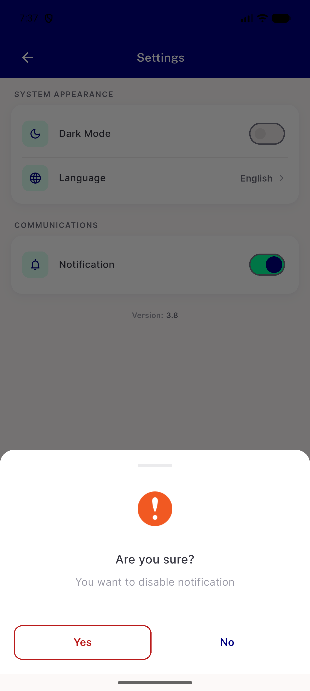
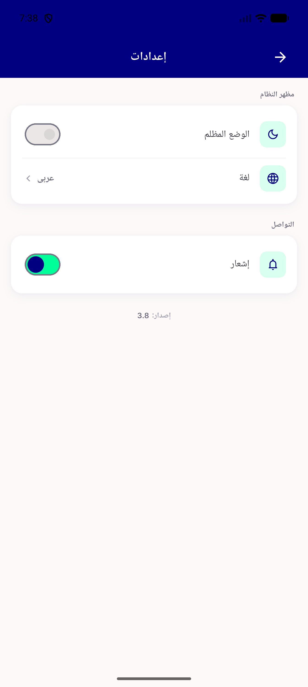

# QA Evidence — NEARS-2867

**PASS — NSwitch at 3 sites, no visible change (before/after pixel-identical settings, geometry+palette-identical cart); AC2-4 pass**

**10 screenshot(s).** Click any thumbnail for full resolution.

<table>
<tr>
<td align="center" width="33%"> ac1a cart cutlery after off</td>
<td align="center" width="33%"> ac1a cart cutlery after on</td>
<td align="center" width="33%"> ac1a cart cutlery before off</td>
</tr>
<tr>
<td align="center" width="33%"> ac1a cart cutlery before on</td>
<td align="center" width="33%"> ac1c settings after light</td>
<td align="center" width="33%"> ac1c settings before light loggedin</td>
</tr>
<tr>
<td align="center" width="33%"> ac1c settings before light</td>
<td align="center" width="33%"> ac2 darkmode glyph tap toggled</td>
<td align="center" width="33%"> ac2 notification glyph tap sheet</td>
</tr>
<tr>
<td align="center" width="33%"> regression settings rtl arabic</td>
</tr>
</table>

### Other artifacts
- [`ac1a-cart-cutlery-after-a11y.xml`](ac1a-cart-cutlery-after-a11y.xml)
- [`ac1a-cart-cutlery-before-a11y.xml`](ac1a-cart-cutlery-before-a11y.xml)
- [`ac1c-settings-after-a11y.xml`](ac1c-settings-after-a11y.xml)
- [`ac1c-settings-before-a11y.xml`](ac1c-settings-before-a11y.xml)
- [`progress.md`](progress.md)

---
*From `nears/docs/qa-evidence/NEARS-2867/` · public-repo scrub policy (no live secrets; verified clean).*
