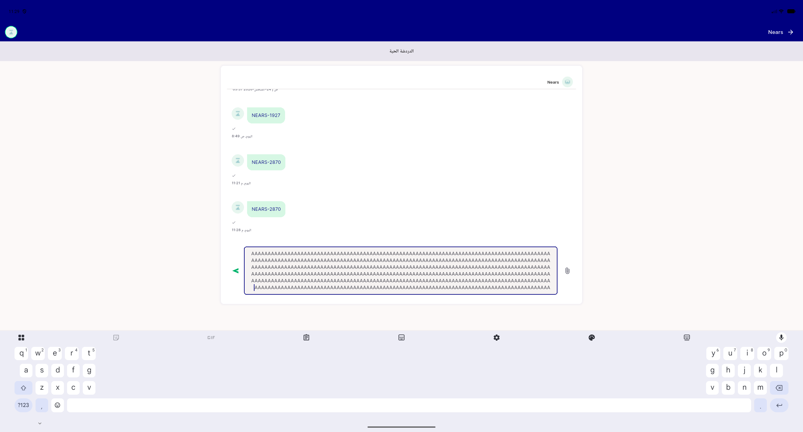
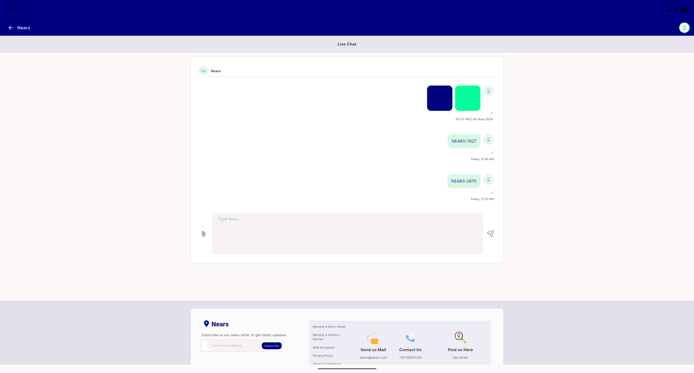
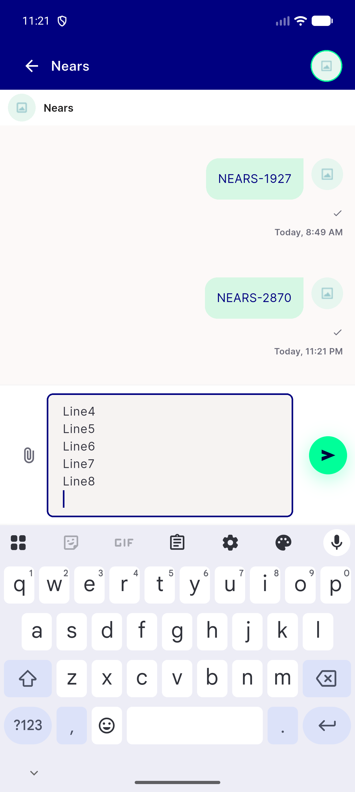
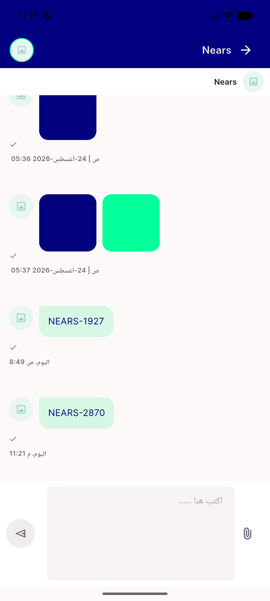
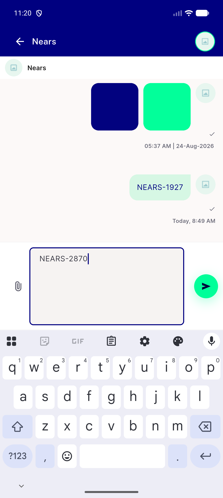
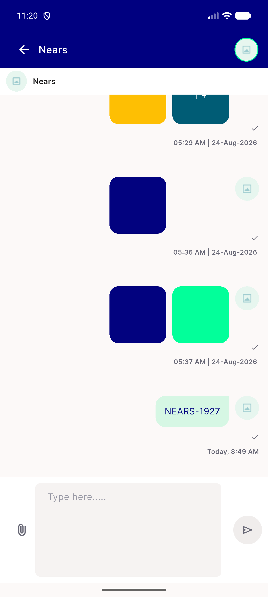

# QA Evidence — NEARS-2870

**PASS — both chat composer arms (mobile+desktop) render via NInput, matches DLS chrome, no regressions**

**6 screenshot(s).** Click any thumbnail for full resolution.

<table>
<tr>
<td align="center" width="33%"> desktop composer rtl</td>
<td align="center" width="33%"> desktop composer</td>
<td align="center" width="33%"> mobile composer multiline</td>
</tr>
<tr>
<td align="center" width="33%"> mobile composer rtl</td>
<td align="center" width="33%"> mobile composer typing</td>
<td align="center" width="33%"> mobile composer</td>
</tr>
</table>

### Other artifacts
- [`progress.md`](progress.md)

---
*From `nears/docs/qa-evidence/NEARS-2870/` · public-repo scrub policy (no live secrets; verified clean).*
