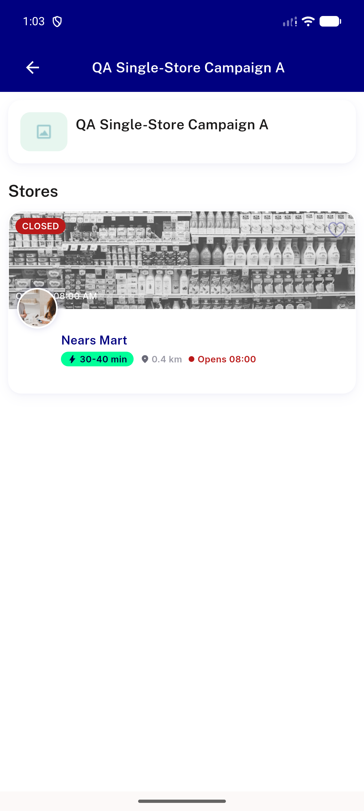
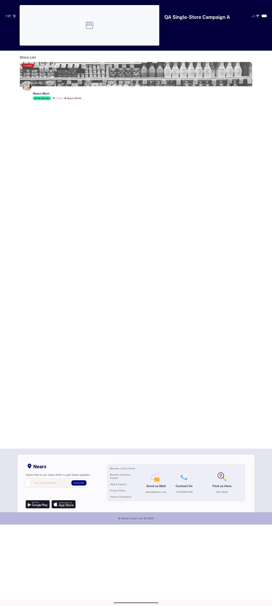
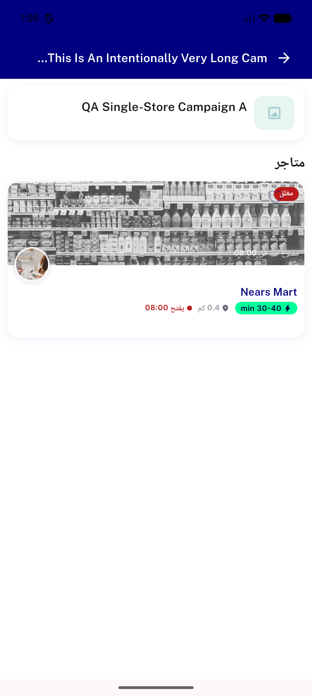
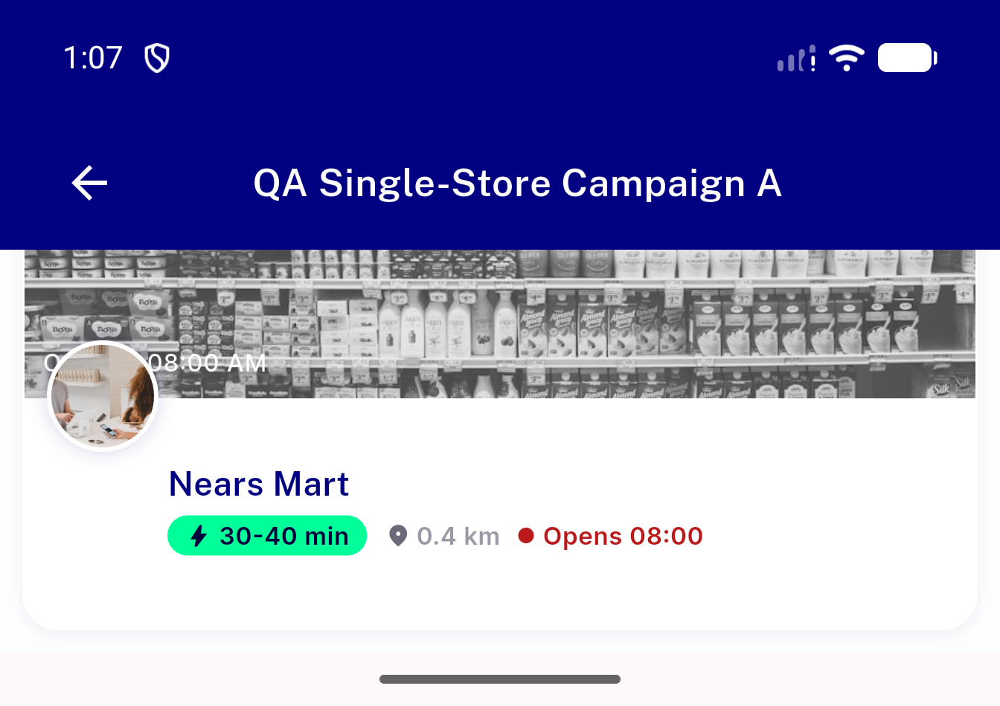

# QA Evidence — NEARS-2872

**PASS: mobile NAppBar chrome, pin-on-scroll, back nav, desktop unaffected, RTL clean**

**4 screenshot(s).** Click any thumbnail for full resolution.

<table>
<tr>
<td align="center" width="33%"> ac1 ac2 mobile nappbar</td>
<td align="center" width="33%"> ac4 desktop hero</td>
<td align="center" width="33%"> ac5 rtl long title</td>
</tr>
<tr>
<td align="center" width="33%"> scroll2 pin scrolled</td>
</tr>
</table>

---
*From `nears/docs/qa-evidence/NEARS-2872/` · public-repo scrub policy (no live secrets; verified clean).*
