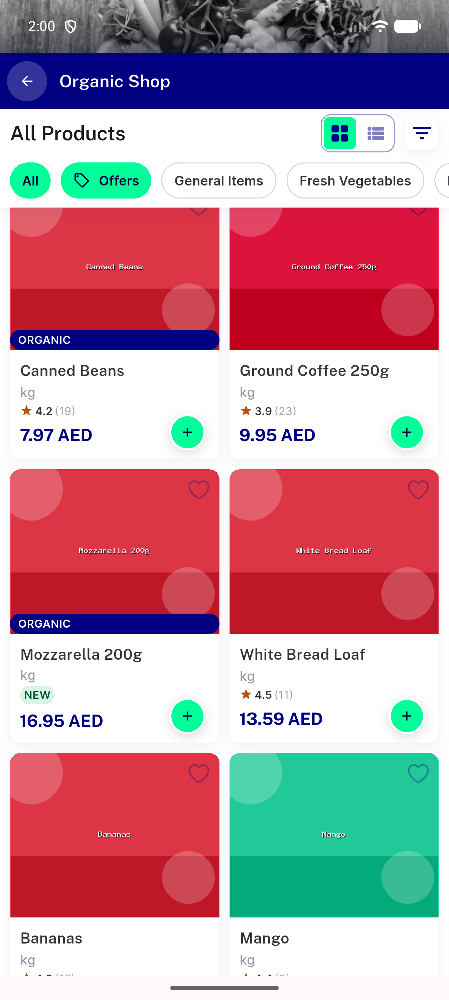
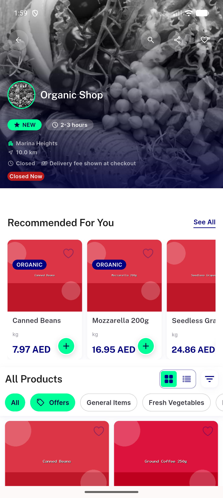

# QA Evidence — NEARS-2873

**PASS - NearsStoreHeader sliver-host migration, mobile store screen**

**2 screenshot(s).** Click any thumbnail for full resolution.

<table>
<tr>
<td align="center" width="33%"> store header collapsed mid scroll</td>
<td align="center" width="33%"> store header organic shop closed</td>
</tr>
</table>

---
*From `nears/docs/qa-evidence/NEARS-2873/` · public-repo scrub policy (no live secrets; verified clean).*
