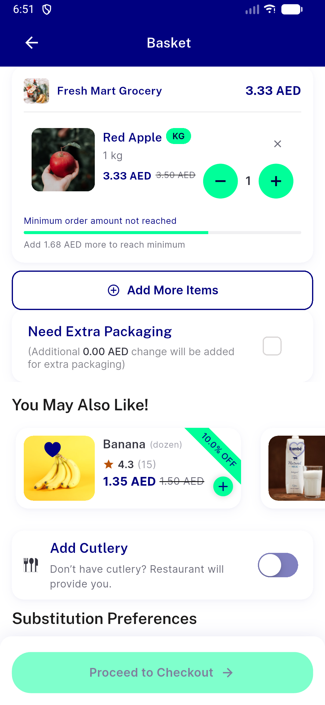

# QA Evidence — NEARS-2874

**PASS -- NLinearProgress swap verified live (site 1), DLS unit tests + code parity for sites 2/3 (env-gated)**

**2 screenshot(s).** Click any thumbnail for full resolution.

<table>
<tr>
<td align="center" width="33%"> ac1 site1 rtl mirroring</td>
<td align="center" width="33%"> ac2 site1 minorder progress</td>
</tr>
</table>

---
*From `nears/docs/qa-evidence/NEARS-2874/` · public-repo scrub policy (no live secrets; verified clean).*
