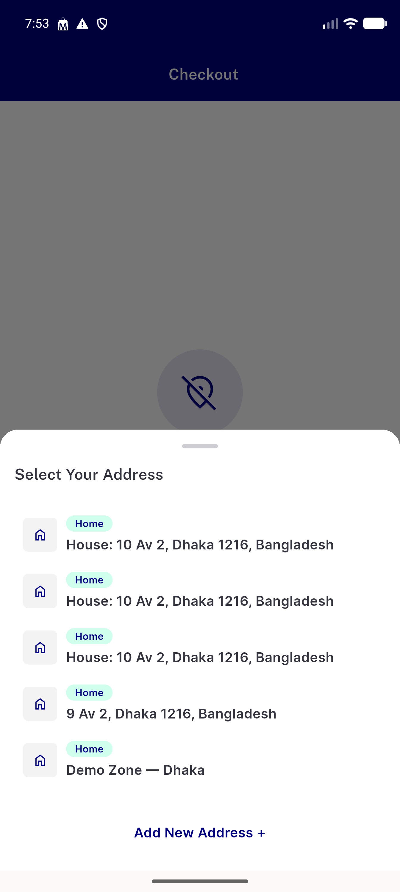
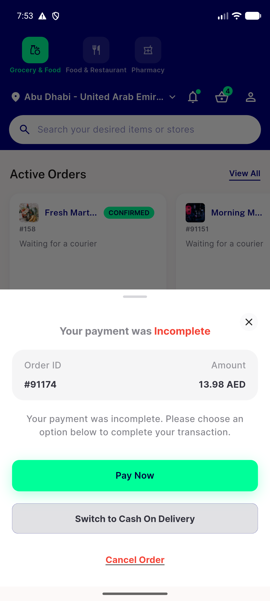
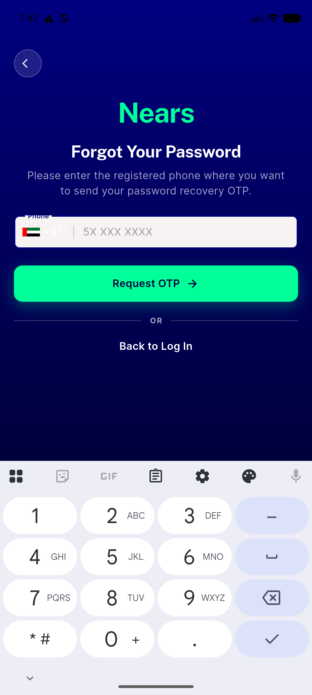
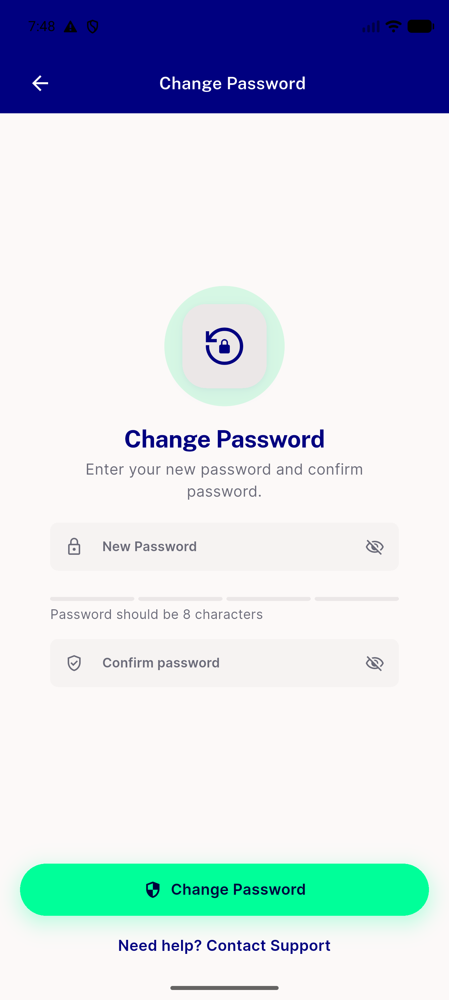
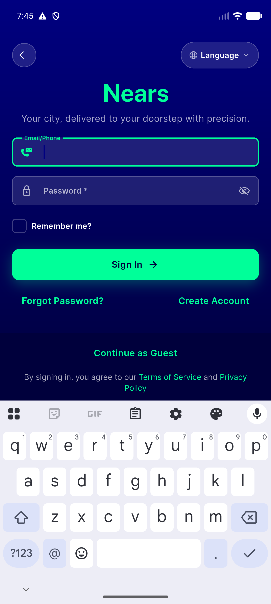

# QA Evidence — NEARS-2876

**PASS - textbutton->nbutton sweep, 5/5 sites live-verified, emulator-5554**

**5 screenshot(s).** Click any thumbnail for full resolution.

<table>
<tr>
<td align="center" width="33%"> ac1 checkout add new address</td>
<td align="center" width="33%"> ac1 digital payment failed cancel order</td>
<td align="center" width="33%"> ac1 forget pass back to login</td>
</tr>
<tr>
<td align="center" width="33%"> ac1 new pass contact support</td>
<td align="center" width="33%"> ac1 signin guest idle</td>
</tr>
</table>

### Other artifacts
- [`ac1-signin-guest-a11y-dump.xml`](ac1-signin-guest-a11y-dump.xml)

---
*From `nears/docs/qa-evidence/NEARS-2876/` · public-repo scrub policy (no live secrets; verified clean).*
