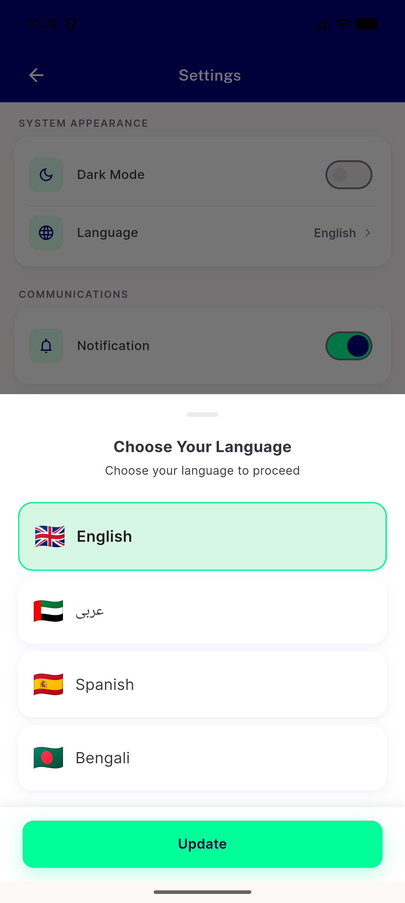
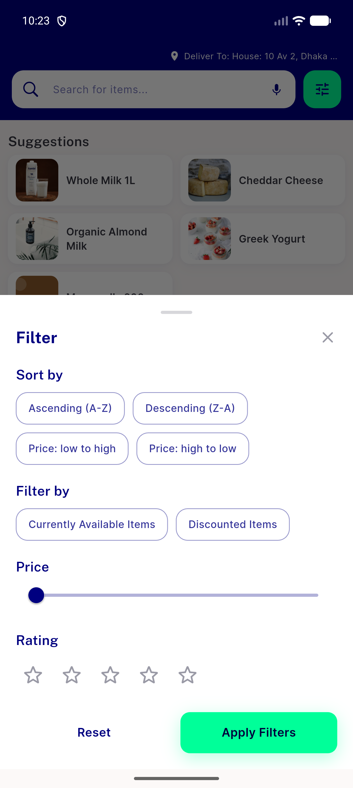
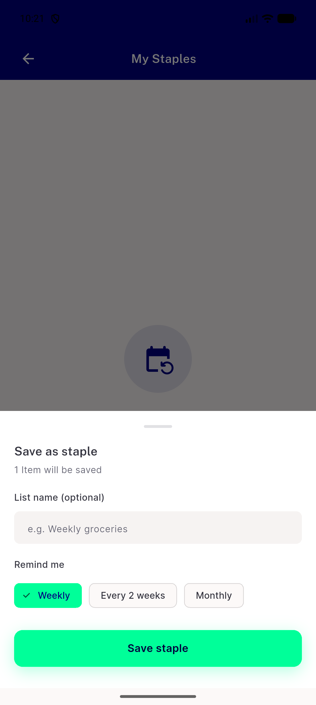
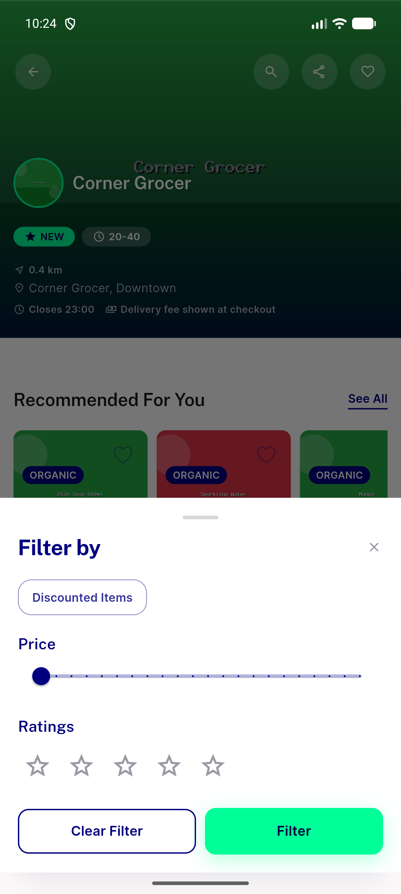

# QA Evidence — NEARS-2878

**PASS - NBottomSheet sheet sweep, 5/5 sites reviewed, 4/5 fully live-demonstrated, AC2 visual spot-check clean**

**4 screenshot(s).** Click any thumbnail for full resolution.

<table>
<tr>
<td align="center" width="33%"> ac1 language sheet</td>
<td align="center" width="33%"> ac1 search filter sheet</td>
<td align="center" width="33%"> ac1 staples sheet</td>
</tr>
<tr>
<td align="center" width="33%"> ac2 store filter sheet</td>
</tr>
</table>

---
*From `nears/docs/qa-evidence/NEARS-2878/` · public-repo scrub policy (no live secrets; verified clean).*
