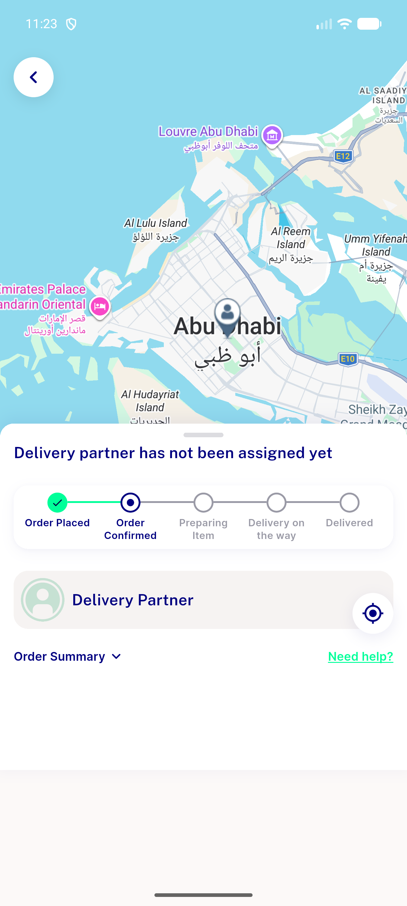
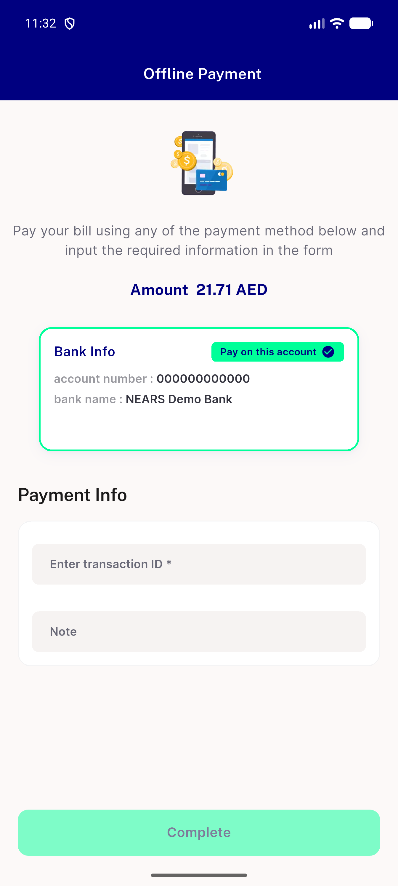
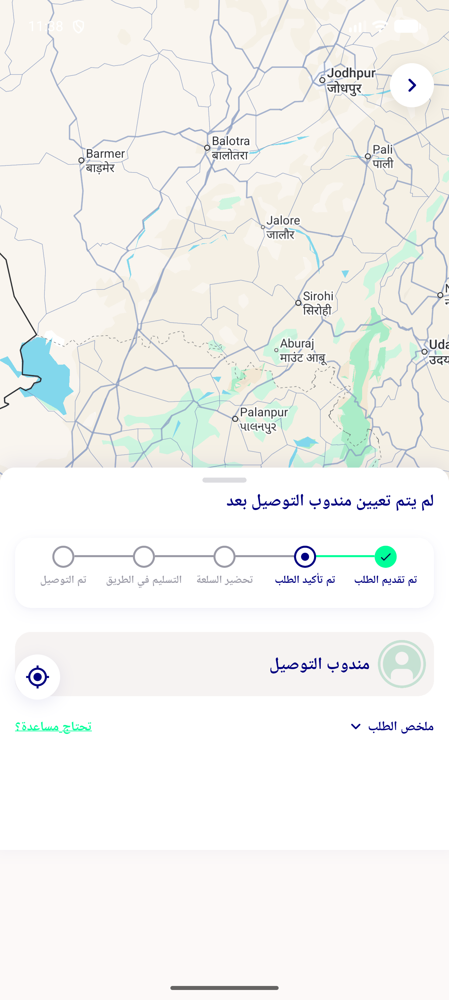
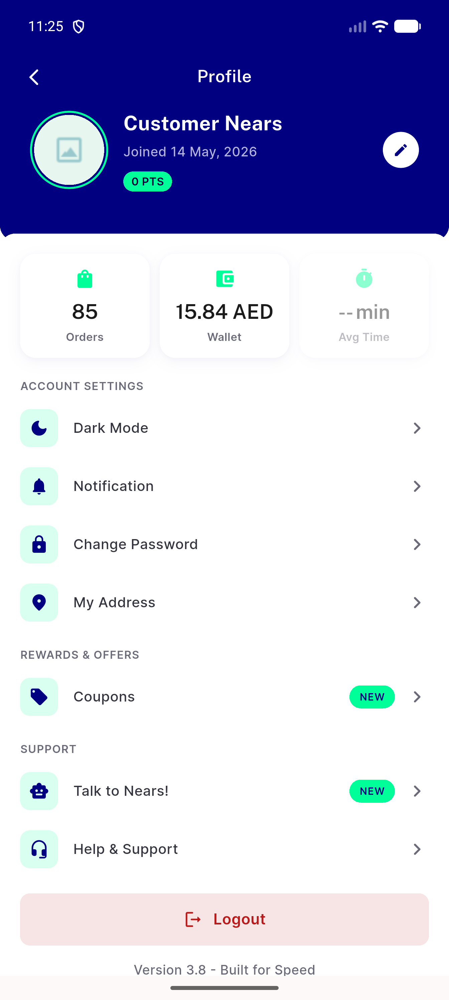
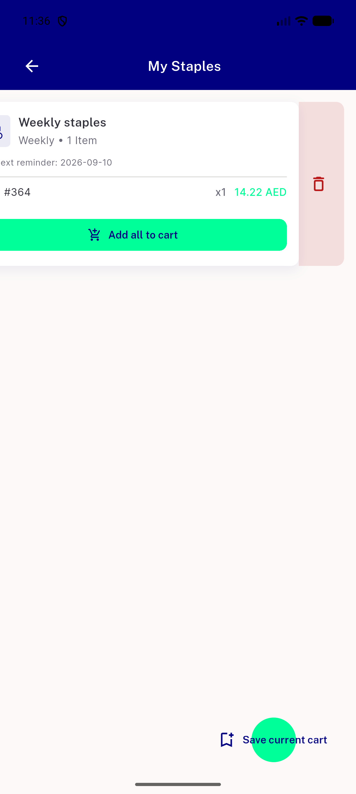
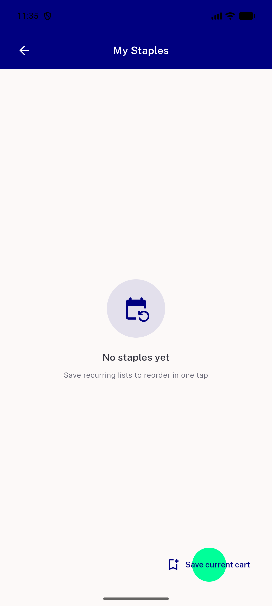

# QA Evidence — NEARS-2879

**PASS - NIcon raw-icon sweep verified live (Android emulator-5556); 1 pre-existing unrelated defect found (search filter icon not rendering, predates this ticket)**

**8 screenshot(s).** Click any thumbnail for full resolution.

<table>
<tr>
<td align="center" width="33%"> ac2 order tracking spotcheck</td>
<td align="center" width="33%"> bug search filter icon missing</td>
<td align="center" width="33%"> flash sale details</td>
</tr>
<tr>
<td align="center" width="33%"> offline payment</td>
<td align="center" width="33%"> order tracking rtl arabic</td>
<td align="center" width="33%"> profile screen</td>
</tr>
<tr>
<td align="center" width="33%"> staples delete swipe</td>
<td align="center" width="33%"> staples save fab</td>
</tr>
</table>

---
*From `nears/docs/qa-evidence/NEARS-2879/` · public-repo scrub policy (no live secrets; verified clean).*
