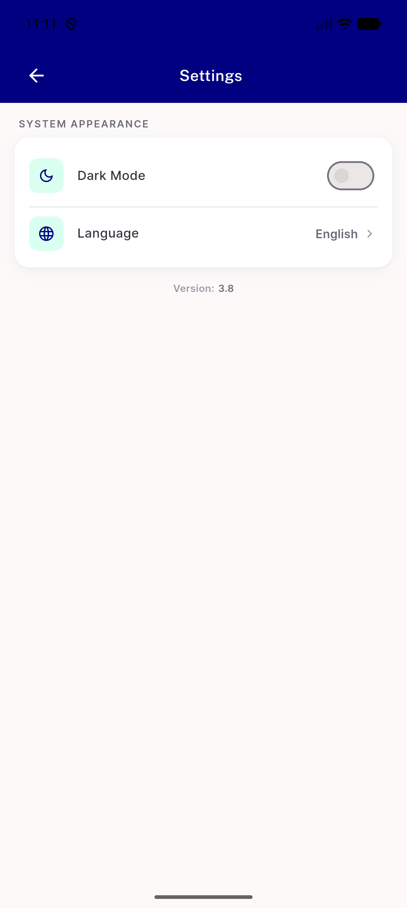
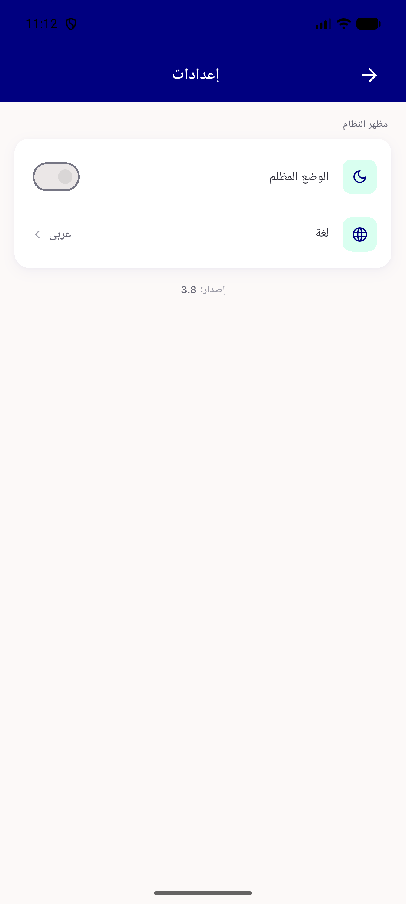

# QA Evidence — NEARS-2880

**PASS -- NDivider swap in setting_page.dart, light+RTL confirmed, no regressions**

**2 screenshot(s).** Click any thumbnail for full resolution.

<table>
<tr>
<td align="center" width="33%"> ac1 settings divider light</td>
<td align="center" width="33%"> ac4 settings divider rtl</td>
</tr>
</table>

---
*From `nears/docs/qa-evidence/NEARS-2880/` · public-repo scrub policy (no live secrets; verified clean).*
