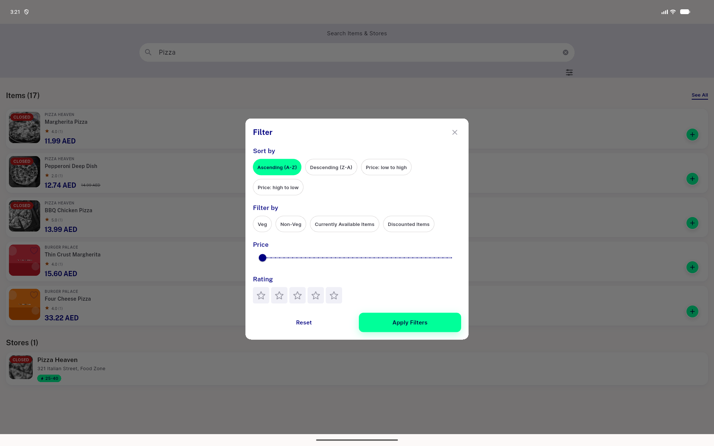

# QA Evidence — NEARS-2881

**PASS - NFilterChip migration in search filter_widget.dart verified live (item-search Dialog, isDesktop viewport); mint-selected/card-surface-unselected confirmed both visually and via a11y selected= attribute; store-search variant unreachable in live UI (code-confirmed shared call site); regression clean**

**1 screenshot(s).** Click any thumbnail for full resolution.

<table>
<tr>
<td align="center" width="33%"> ac1 ac2 filter dialog nfilterchip selected</td>
</tr>
</table>

---
*From `nears/docs/qa-evidence/NEARS-2881/` · public-repo scrub policy (no live secrets; verified clean).*
