# QA Evidence — NEARS-2883

**PASS -- mechanical NearsColors->NearsTokens sweep, zero visual regression across cart/store/search/checkout/profile/address, flutter analyze clean, flutter test 5623 passed**

**12 screenshot(s).** Click any thumbnail for full resolution.

<table>
<tr>
<td align="center" width="33%"><a href="add-address-map-light.png">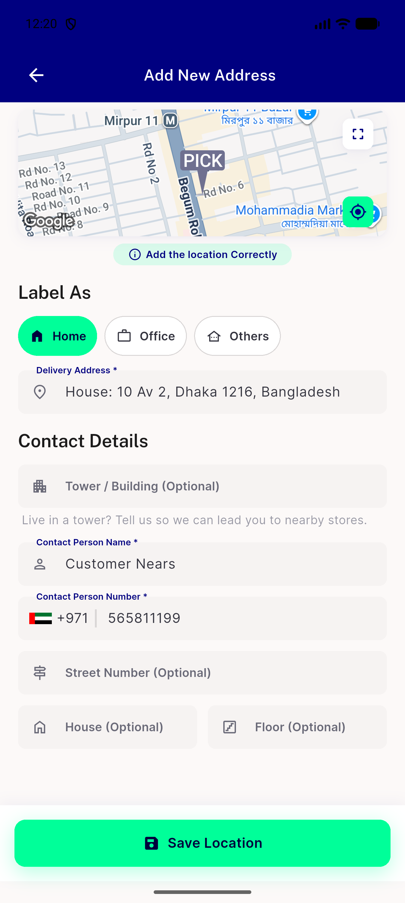</a> add address map light</td>
<td align="center" width="33%"><a href="address-list-light.png">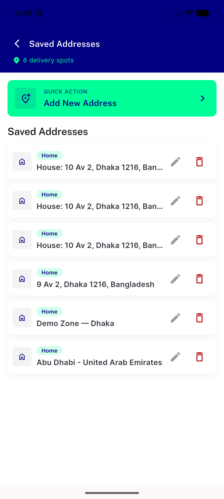</a> address list light</td>
<td align="center" width="33%"><a href="cart-screen-light.png">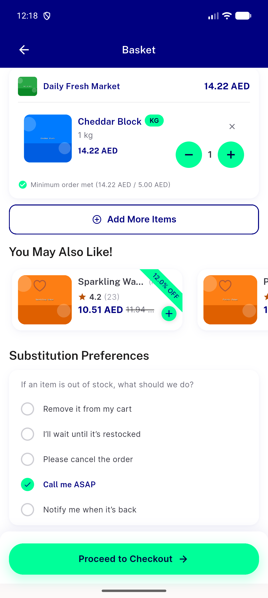</a> cart screen light</td>
</tr>
<tr>
<td align="center" width="33%"><a href="checkout-coupon-payment-tips-light.png">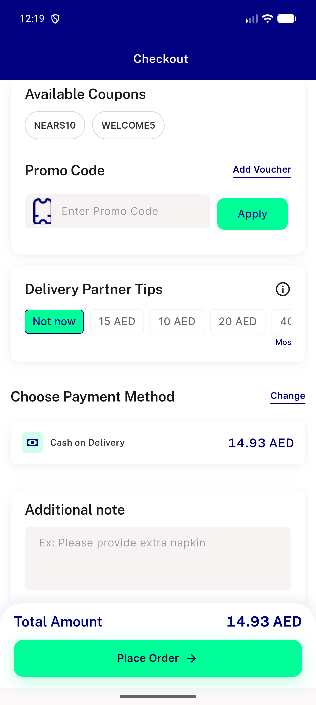</a> checkout coupon payment tips light</td>
<td align="center" width="33%"><a href="checkout-screen-light.png">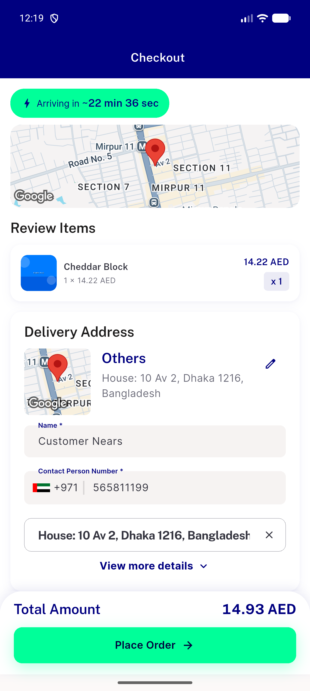</a> checkout screen light</td>
<td align="center" width="33%"><a href="filter-sheet-light.png">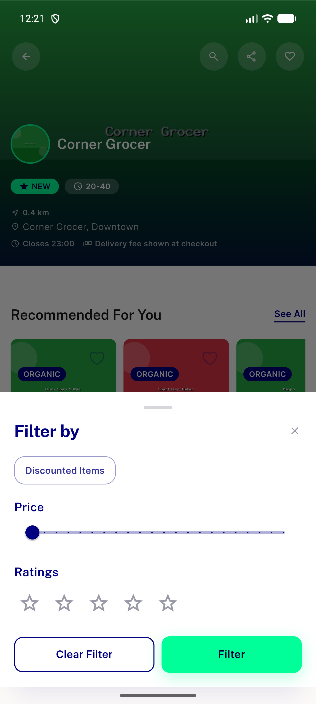</a> filter sheet light</td>
</tr>
<tr>
<td align="center" width="33%"><a href="forget-pass-light.png">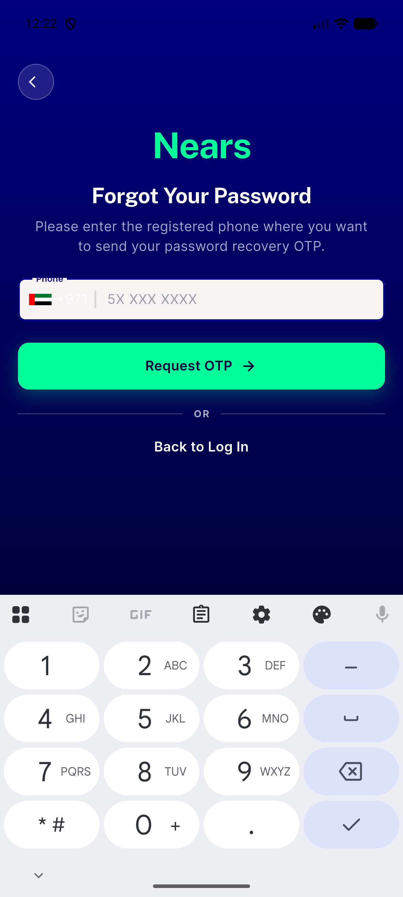</a> forget pass light</td>
<td align="center" width="33%"><a href="home-grocery-light.png">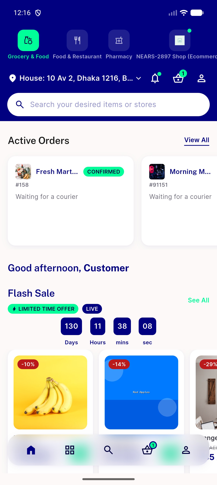</a> home grocery light</td>
<td align="center" width="33%"><a href="payment-method-sheet-light.png">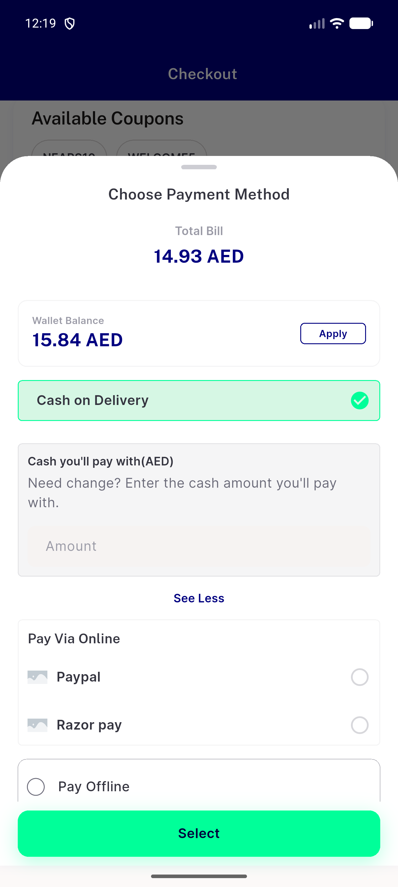</a> payment method sheet light</td>
</tr>
<tr>
<td align="center" width="33%"><a href="profile-screen-light.png">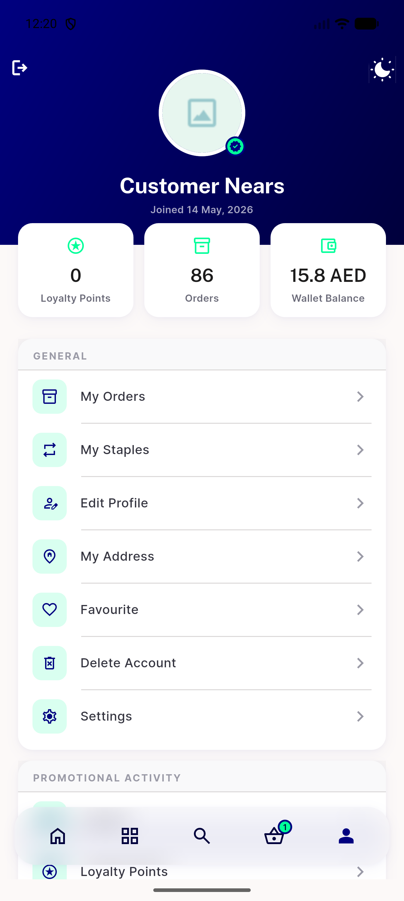</a> profile screen light</td>
<td align="center" width="33%"><a href="search-screen-light.png">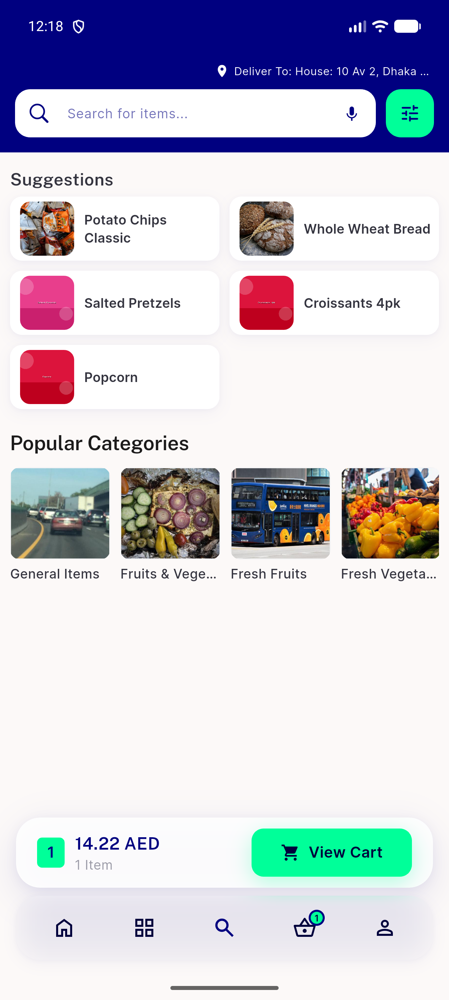</a> search screen light</td>
<td align="center" width="33%"><a href="store-screen-light.png">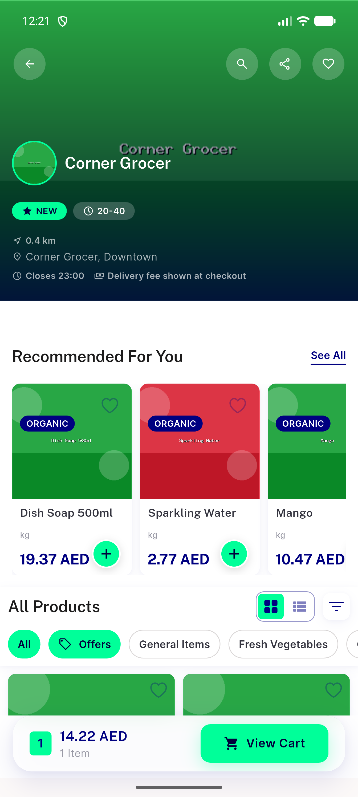</a> store screen light</td>
</tr>
</table>

---
*From `nears/docs/qa-evidence/NEARS-2883/` · public-repo scrub policy (no live secrets; verified clean).*
