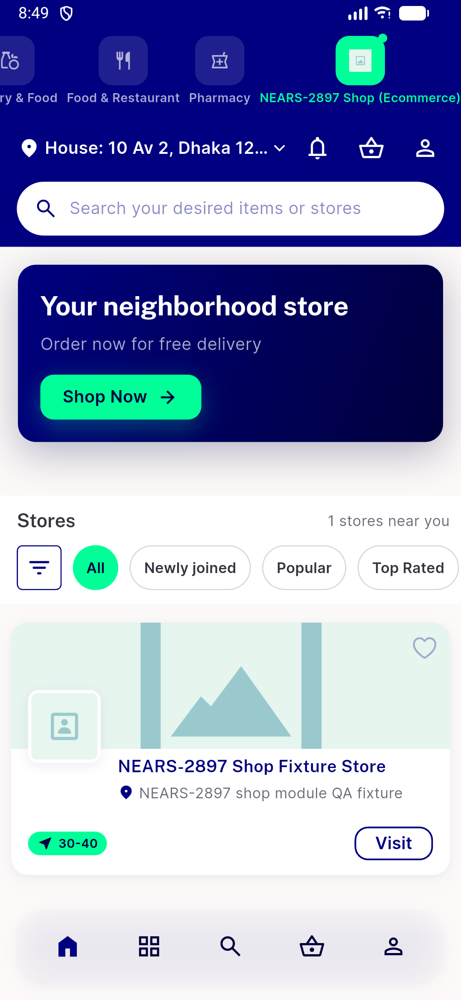

# QA Evidence — NEARS-2886

**QA-lite PASS: await recursive client-leg fetch fixes busy-latch timing**

**1 screenshot(s).** Click any thumbnail for full resolution.

<table>
<tr>
<td align="center" width="33%"> shop module home live smoke</td>
</tr>
</table>

### Other artifacts
- [`data-dor-gap-brands-table-empty.log`](data-dor-gap-brands-table-empty.log)
- [`timing-probe-output.log`](timing-probe-output.log)

---
*From `nears/docs/qa-evidence/NEARS-2886/` · public-repo scrub policy (no live secrets; verified clean).*
