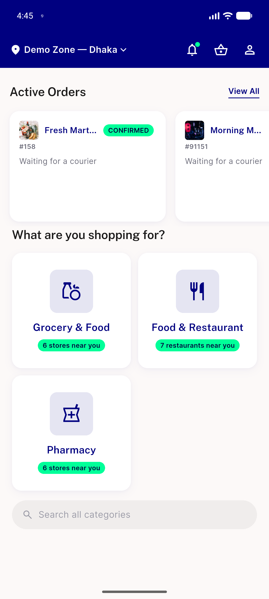

# QA Evidence — NEARS-2887

**PASS — parcel module explicit-skip verified live via response-rewrite proxy (activeStoresCount forced >0), unit backstop 130+38/168 pass, flutter analyze clean**

**1 screenshot(s).** Click any thumbnail for full resolution.

<table>
<tr>
<td align="center" width="33%"> ac1 parcel excluded activestorescount3</td>
</tr>
</table>

---
*From `nears/docs/qa-evidence/NEARS-2887/` · public-repo scrub policy (no live secrets; verified clean).*
