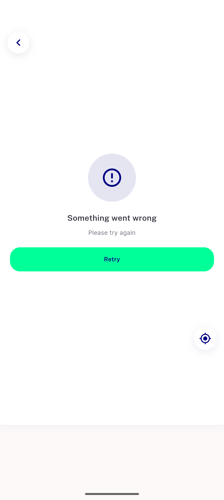
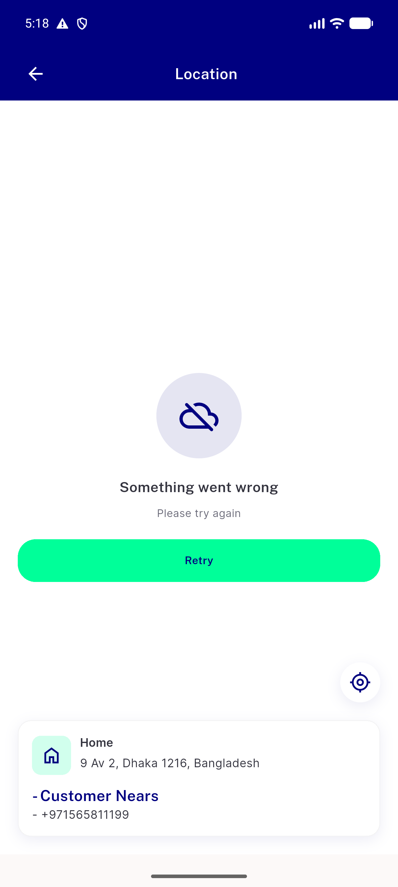
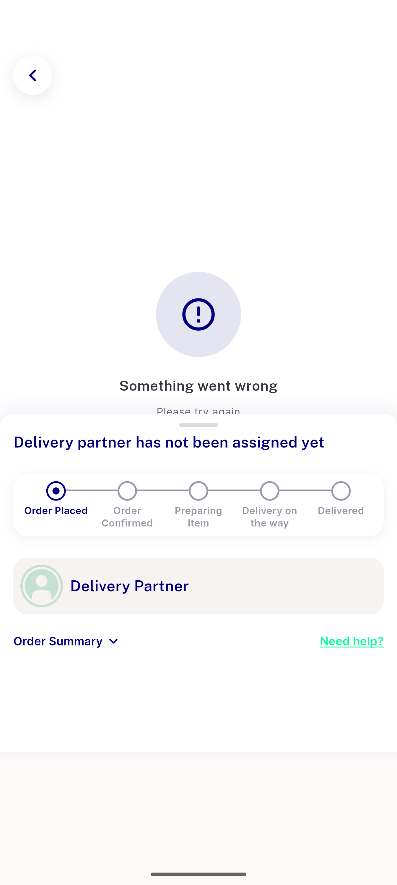
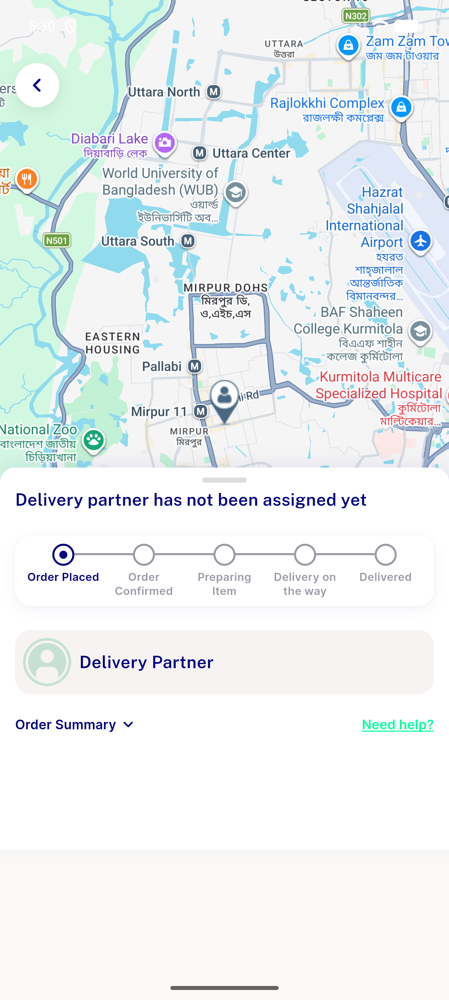

# QA Evidence — NEARS-2889

**Re-QA cycle 1 PASS: order_tracking_screen Retry fix verified live (Stack reorder), back chevron/FAB confirmed reachable during error overlay, happy path clean, 493/493 automated**

**4 screenshot(s).** Click any thumbnail for full resolution.

<table>
<tr>
<td align="center" width="33%"> ac retry fixed order tracking</td>
<td align="center" width="33%"> ac1 map screen watchdog error retry</td>
<td align="center" width="33%"> ac1 order tracking watchdog error retry</td>
</tr>
<tr>
<td align="center" width="33%"> regression order tracking poll no false fire</td>
</tr>
</table>

### Other artifacts
- [`bug-order-tracking-retry-no-effect.log`](bug-order-tracking-retry-no-effect.log)
- [`bug-usemylocation-null-bounds-preexisting.log`](bug-usemylocation-null-bounds-preexisting.log)

---
*From `nears/docs/qa-evidence/NEARS-2889/` · public-repo scrub policy (no live secrets; verified clean).*
