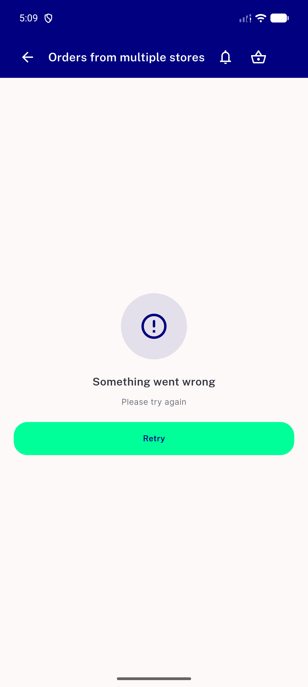
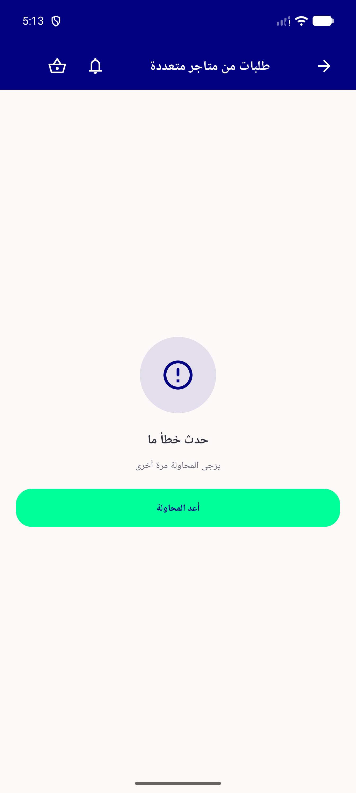
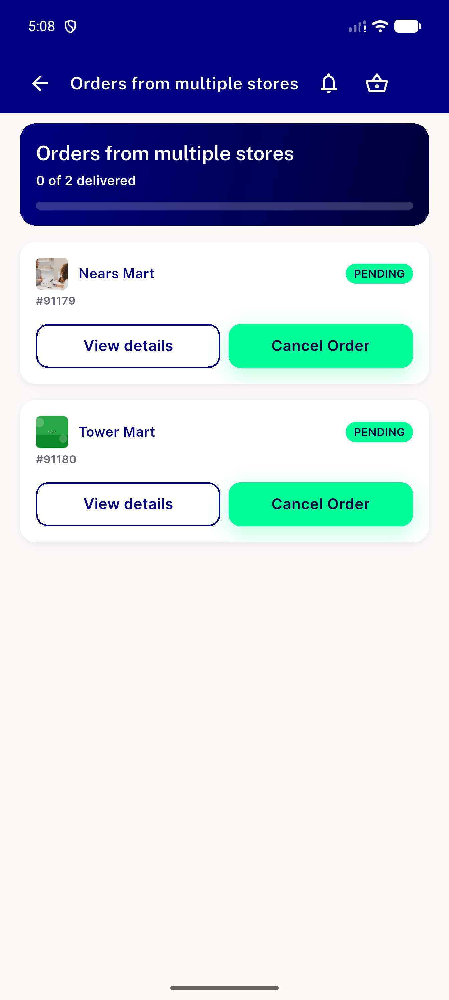

# QA Evidence — NEARS-2890

**PASS — NEARS-2890 group-roster error/retry, full AC live-QA, 4 shots + progress notes**

**4 screenshot(s).** Click any thumbnail for full resolution.

<table>
<tr>
<td align="center" width="33%"> ac1 ac7 error retry state</td>
<td align="center" width="33%"> ac2 retry recovered</td>
<td align="center" width="33%"> ac6 rtl arabic error retry</td>
</tr>
<tr>
<td align="center" width="33%"> baseline normal header</td>
</tr>
</table>

### Other artifacts
- [`progress.md`](progress.md)

---
*From `nears/docs/qa-evidence/NEARS-2890/` · public-repo scrub policy (no live secrets; verified clean).*
