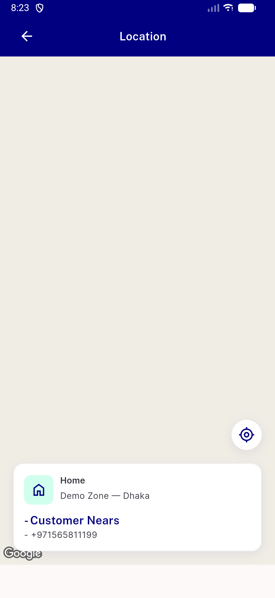

# QA Evidence — NEARS-2894

**FAIL — checkModuleId tappedAddress zone-scoping crashes (setState-during-build) on every no-location-branch tap, silently skipping module verification (AC1 false-positive, AC3 new [FAIL], AC4 overcorrects to always-allow)**

**2 screenshot(s).** Click any thumbnail for full resolution.

<table>
<tr>
<td align="center" width="33%"> ac1 mapscreen rendered</td>
<td align="center" width="33%"> ac4 mapscreen wrongly shown module4 zone1</td>
</tr>
</table>

### Other artifacts
- [`bug-ac1-setstate-during-build.log`](bug-ac1-setstate-during-build.log)
- [`bug-ac4-overcorrect-always-allow.log`](bug-ac4-overcorrect-always-allow.log)

---
*From `nears/docs/qa-evidence/NEARS-2894/` · public-repo scrub policy (no live secrets; verified clean).*
