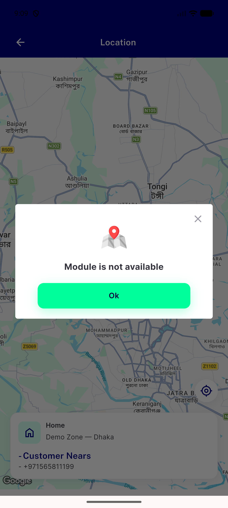

# QA Evidence — NEARS-2894

**cycle-1 re-QA: PASS — AC1/AC2/AC3/AC4 all live-verified, regressions clean**

**1 screenshot(s).** Click any thumbnail for full resolution.

<table>
<tr>
<td align="center" width="33%"> cycle1 ac4 zonewarning module4 zone1</td>
</tr>
</table>

### Other artifacts
- [`cycle1-ac1ac2ac3-clean-module-verified.log`](cycle1-ac1ac2ac3-clean-module-verified.log)
- [`cycle1-ac4-modulenotfound-fail.log`](cycle1-ac4-modulenotfound-fail.log)
- [`cycle1-regression-wishlist-422.log`](cycle1-regression-wishlist-422.log)
- [`cycle1-store-location-icon-a11y-dump.xml`](cycle1-store-location-icon-a11y-dump.xml)

---
*From `nears/docs/qa-evidence/NEARS-2894/` · public-repo scrub policy (no live secrets; verified clean).*
