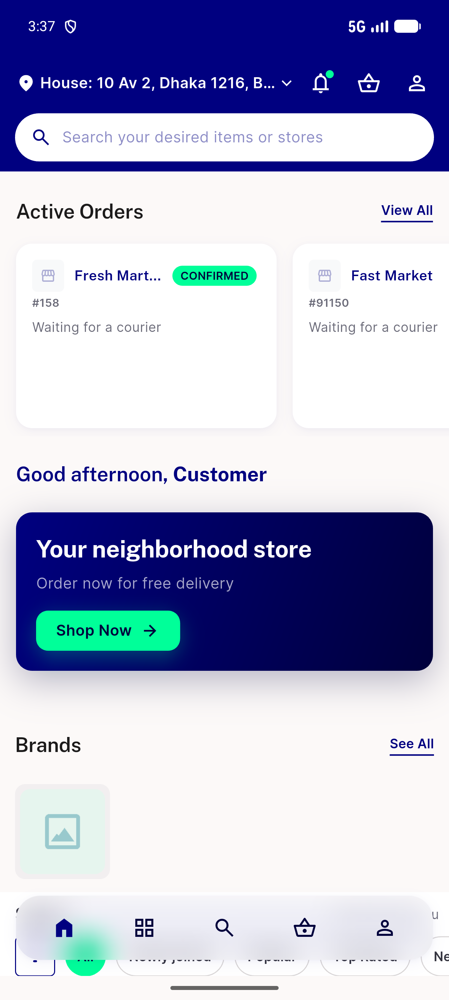

# QA Evidence — NEARS-2897

**QA FAIL — AC1/AC2 blocked: PopularStoreView/RecommendedStoreView self-hide (single-store gate); pre-existing module_config cache staleness fixed to unblock nav**

**1 screenshot(s).** Click any thumbnail for full resolution.

<table>
<tr>
<td align="center" width="33%"> bug ac1 popularstoreview selfhides shop home</td>
</tr>
</table>

### Other artifacts
- [`bug-ac1-popularstoreview-selfhides-shop-home.log`](bug-ac1-popularstoreview-selfhides-shop-home.log)
- [`bug-ac1-popularstoreview-selfhides-shop-home.xml`](bug-ac1-popularstoreview-selfhides-shop-home.xml)
- [`bug-stale-module-config-cache-crash.log`](bug-stale-module-config-cache-crash.log)

---
*From `nears/docs/qa-evidence/NEARS-2897/` · public-repo scrub policy (no live secrets; verified clean).*
