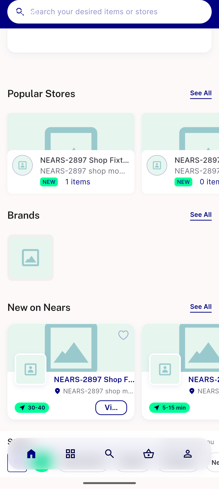
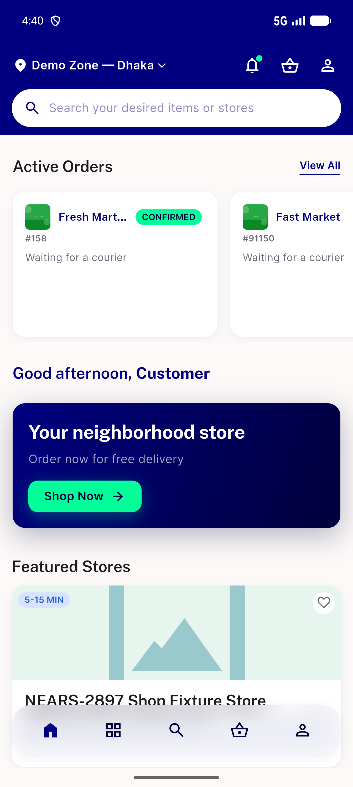
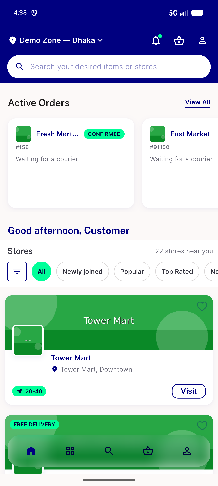

# QA Evidence — NEARS-2897

**cycle1 delta re-QA PASS: AC1+AC2 live-confirmed via deep-link past pre-existing module_config cache bug (cycle-0-documented, unrelated)**

**4 screenshot(s).** Click any thumbnail for full resolution.

<table>
<tr>
<td align="center" width="33%"> bug ac1 popularstoreview selfhides shop home</td>
<td align="center" width="33%"> cycle1 ac1 ac2 shop home live render</td>
<td align="center" width="33%"> cycle1 ac1 popular stores see all page</td>
</tr>
<tr>
<td align="center" width="33%"> cycle1 module home render substitute</td>
</tr>
</table>

### Other artifacts
- [`bug-ac1-popularstoreview-selfhides-shop-home.log`](bug-ac1-popularstoreview-selfhides-shop-home.log)
- [`bug-ac1-popularstoreview-selfhides-shop-home.xml`](bug-ac1-popularstoreview-selfhides-shop-home.xml)
- [`bug-stale-module-config-cache-crash.log`](bug-stale-module-config-cache-crash.log)

---
*From `nears/docs/qa-evidence/NEARS-2897/` · public-repo scrub policy (no live secrets; verified clean).*
