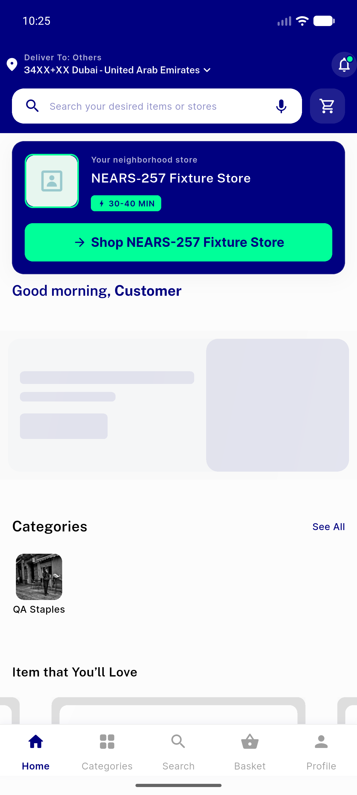
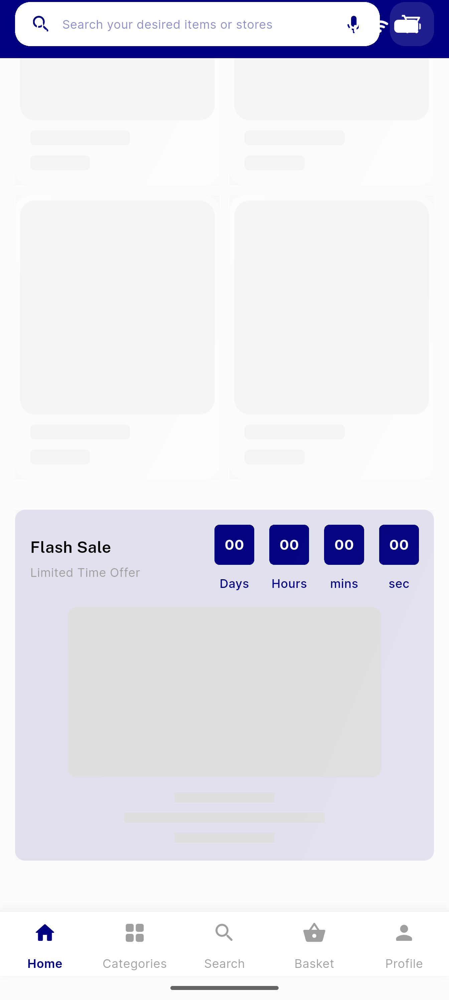
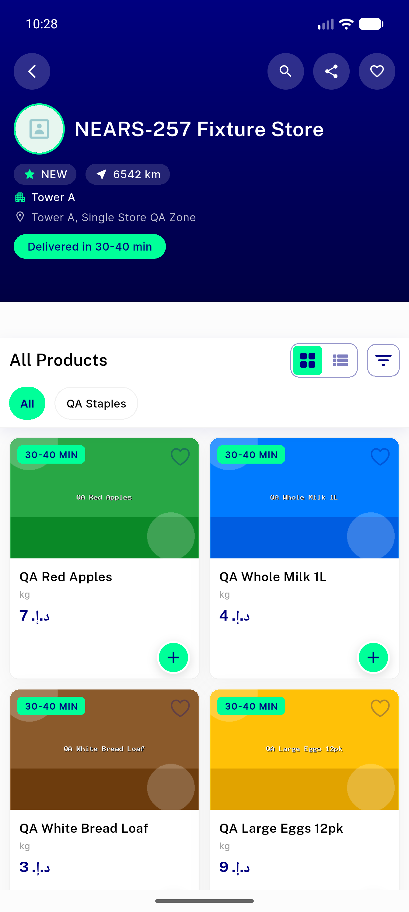
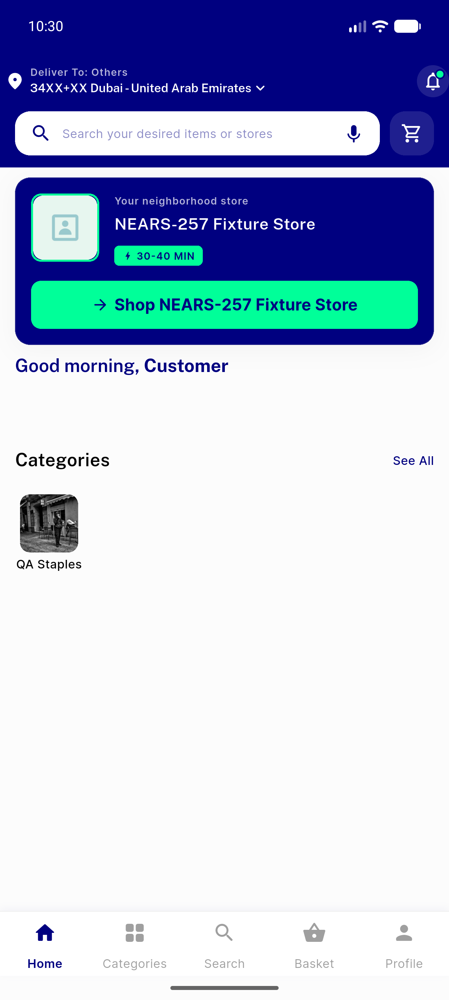
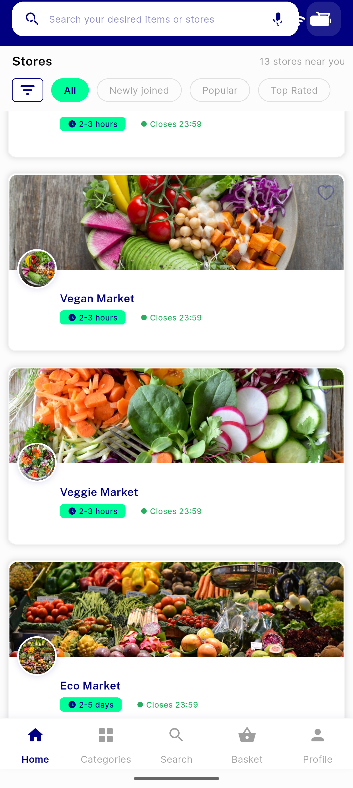
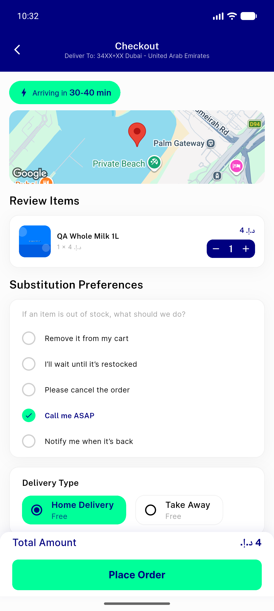

# QA Evidence — NEARS-290

**Single-store Home (trimmed-hero, model b) · Verdict: ✅ PASS**

Fixture: zone-3 / store-59 (single-store) vs zone-2 (multi-store control). Each shot maps to an acceptance criterion. **Click any thumbnail for full resolution.**

<table>
<tr>
<td align="center" width="33%"> <b>1</b> · trimmed navy hero on single-store Home</td>
<td align="center" width="33%"> <b>2</b> · duplicate All-Stores surfaces suppressed</td>
<td align="center" width="33%"> <b>3</b> · hero tap opens store 59 (no boot auto-nav)</td>
</tr>
<tr>
<td align="center" width="33%"> <b>4</b> · cold start rests on Home (no nav race)</td>
<td align="center" width="33%"> <b>5</b> · control: multi-store zone 2 still shows All-Stores</td>
<td align="center" width="33%"> <b>6</b> · checkout reachable</td>
</tr>
</table>

---
*Generated from `nears/docs/qa-evidence/NEARS-290/` under the public-repo scrub policy (no live secrets; verified clean).*
