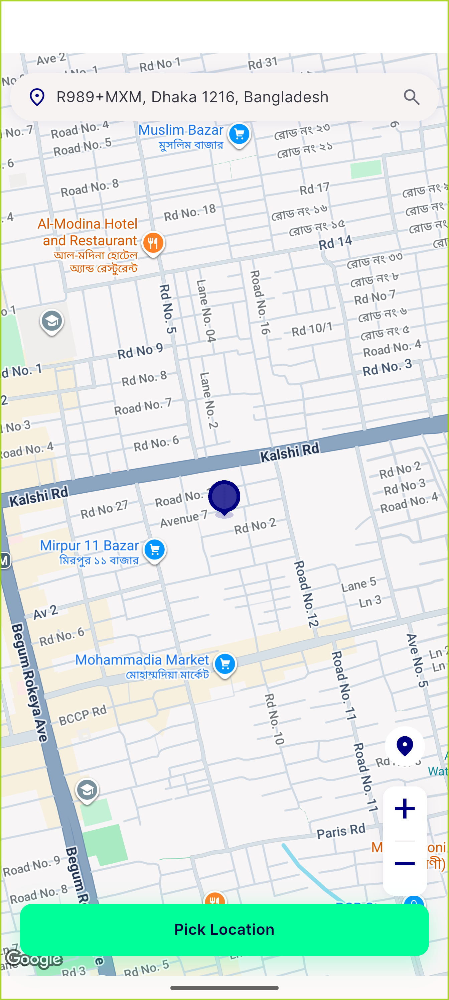
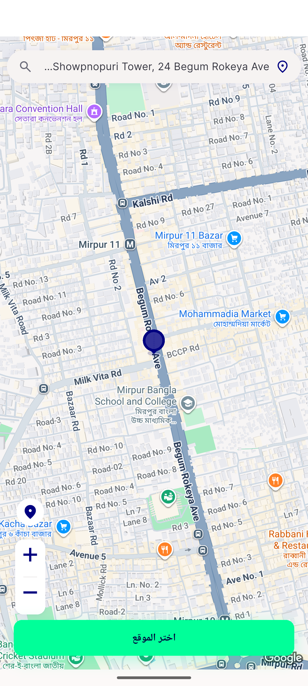
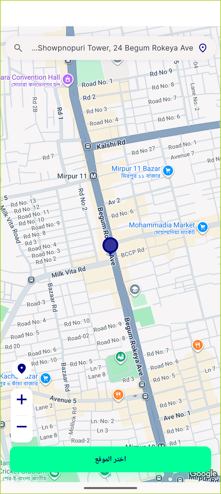

# QA Evidence — NEARS-2900

**PASS — FAB double geocode/zone lookup fixed: base 2/2 -> fix 1/1, 2 toasts -> 1 (emulator-5562, 5f8513d1b)**

**4 screenshot(s).** Click any thumbnail for full resolution.

<table>
<tr>
<td align="center" width="33%"> bug rc1 stale address after drag then fab</td>
<td align="center" width="33%"> bug rc2 button enabled stale address</td>
<td align="center" width="33%"> entryB after fab inzone pick address enabled</td>
</tr>
<tr>
<td align="center" width="33%"> rtl ar pick map after fab</td>
</tr>
</table>

### Other artifacts
- [`baseline-displaced-fab-tap.log`](baseline-displaced-fab-tap.log)
- [`baseline-failure-fab-tap.log`](baseline-failure-fab-tap.log)
- [`baseline-mapopen-autofetch.log`](baseline-mapopen-autofetch.log)
- [`bug-rc1-stale-address-after-drag-then-fab.log`](bug-rc1-stale-address-after-drag-then-fab.log)
- [`bug-rc2-button-enabled-stale-address-samples.log`](bug-rc2-button-enabled-stale-address-samples.log)
- [`bug-rc2-button-enabled-stale-address.log`](bug-rc2-button-enabled-stale-address.log)
- [`fix-ac2-ac3-failure-fab-tap.log`](fix-ac2-ac3-failure-fab-tap.log)
- [`fix-addaddress-use-current-location.log`](fix-addaddress-use-current-location.log)
- [`fix-centred-tap-wait-drag.log`](fix-centred-tap-wait-drag.log)
- [`fix-entryA-displaced-fab-tap.log`](fix-entryA-displaced-fab-tap.log)
- [`fix-entryA-mapopen-autofetch.log`](fix-entryA-mapopen-autofetch.log)
- [`fix-entryB-displaced-fab-tap.log`](fix-entryB-displaced-fab-tap.log)
- [`fix-inzone-fab-x5.log`](fix-inzone-fab-x5.log)
- [`fix-mid-animation-grab.log`](fix-mid-animation-grab.log)
- [`fix-poscontrol-drag-after-fab.log`](fix-poscontrol-drag-after-fab.log)
- [`fix-poscontrol-drag-back.log`](fix-poscontrol-drag-back.log)
- [`fix-poscontrol-fab-drag-dragback.log`](fix-poscontrol-fab-drag-dragback.log)
- [`fix-rapid-double-tap.log`](fix-rapid-double-tap.log)
- [`fix-rtl-displaced-fab-tap.log`](fix-rtl-displaced-fab-tap.log)
- [`fix-rtl-mapopen-autofetch.log`](fix-rtl-mapopen-autofetch.log)
- [`fix-slownet-inzone-button-samples.log`](fix-slownet-inzone-button-samples.log)
- [`fix-slownet-inzone-fab-tap.log`](fix-slownet-inzone-fab-tap.log)
- [`fix-slownet-outzone-button-samples.log`](fix-slownet-outzone-button-samples.log)
- [`fix-slownet-outzone-fab-tap.log`](fix-slownet-outzone-fab-tap.log)
- [`fix-slowzone-inzone-button-samples.log`](fix-slowzone-inzone-button-samples.log)
- [`fix-slowzone-inzone-fab-tap.log`](fix-slowzone-inzone-fab-tap.log)
- [`fix-slowzone-outzone-button-samples.log`](fix-slowzone-outzone-button-samples.log)
- [`fix-slowzone-outzone-fab-tap.log`](fix-slowzone-outzone-fab-tap.log)
- [`progress.md`](progress.md)
- [`rc1-drag-gap-fab.log`](rc1-drag-gap-fab.log)
- [`rc1-drag-then-fab.log`](rc1-drag-then-fab.log)
- [`regression-search-location-pick.log`](regression-search-location-pick.log)

---
*From `nears/docs/qa-evidence/NEARS-2900/` · public-repo scrub policy (no live secrets; verified clean).*
