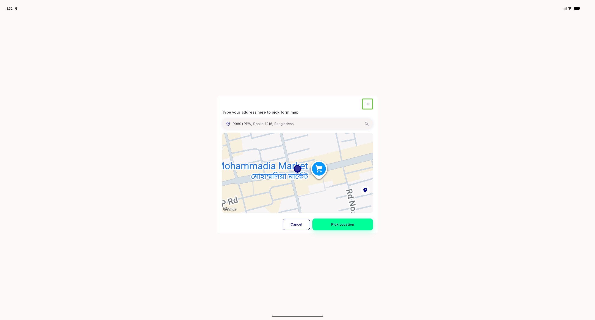
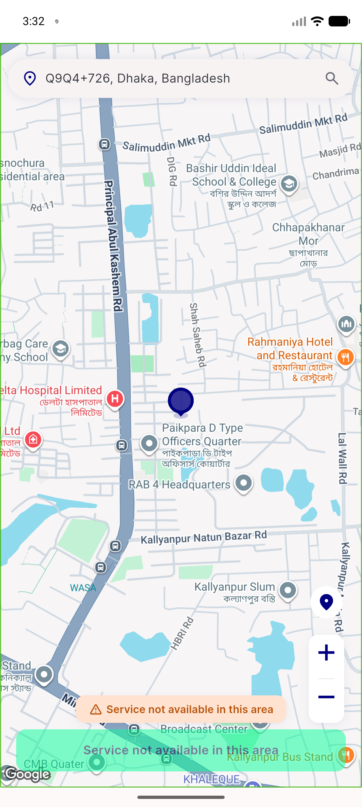

# QA Evidence — NEARS-2901

**PASS -- pick_map_screen locate-me FAB + out-of-zone buttons a11y fix verified live (mobile+desktop layouts), zero NAF nodes, TalkBack reachable**

**2 screenshot(s).** Click any thumbnail for full resolution.

<table>
<tr>
<td align="center" width="33%"> desktop fab labeled</td>
<td align="center" width="33%"> mobile fab labeled</td>
</tr>
</table>

### Other artifacts
- [`census-desktop-dump.xml`](census-desktop-dump.xml)
- [`census-mobile-dump.xml`](census-mobile-dump.xml)

---
*From `nears/docs/qa-evidence/NEARS-2901/` · public-repo scrub policy (no live secrets; verified clean).*
