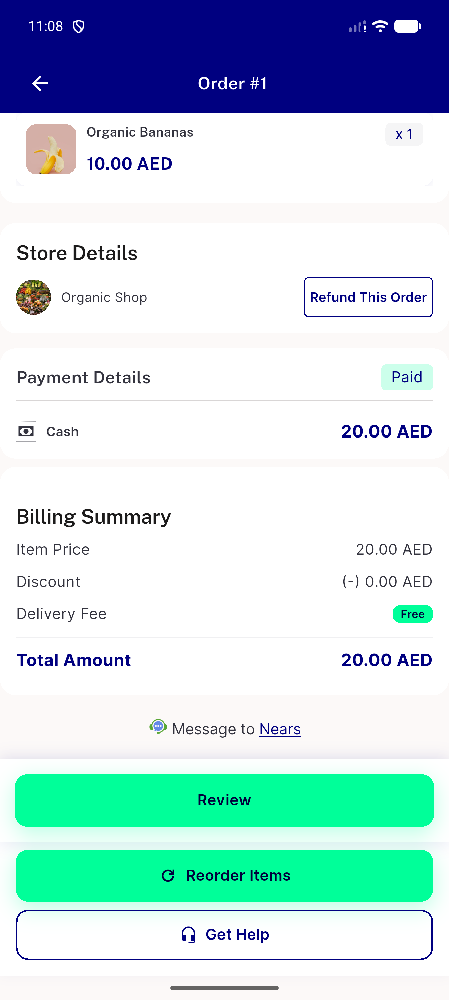
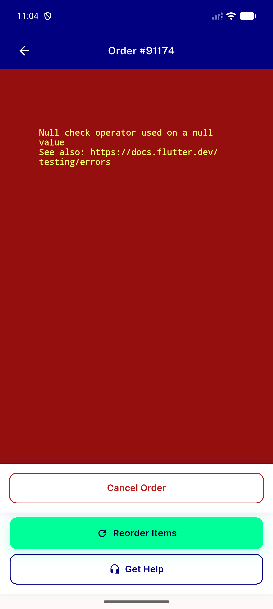

# QA Evidence — NEARS-2902

**FAIL - AC1 blocked by live crash (unrelated null item_details on same repro order), AC2 PASS**

**2 screenshot(s).** Click any thumbnail for full resolution.

<table>
<tr>
<td align="center" width="33%"> ac2 order 1 healthy render</td>
<td align="center" width="33%"> bug order 91174 itemdetails null crash</td>
</tr>
</table>

### Other artifacts
- [`bug-order-91174-itemdetails-null-crash.log`](bug-order-91174-itemdetails-null-crash.log)

---
*From `nears/docs/qa-evidence/NEARS-2902/` · public-repo scrub policy (no live secrets; verified clean).*
