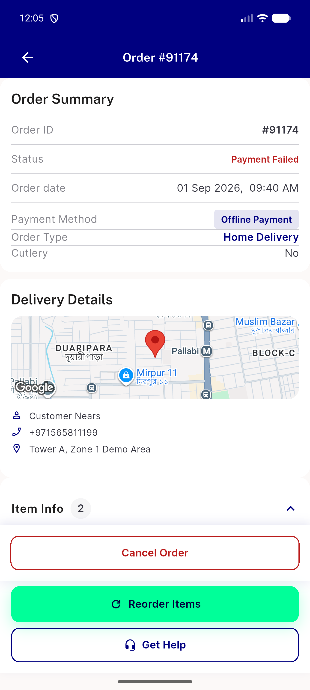

# QA Evidence — NEARS-2902

**cycle2 FAIL: AC1 no-crash confirmed but item-rows section renders blank for order #91174 (task_bug); AC2 healthy-order spot-check reused/green; review-flow secondary check unverifiable (no delivered+null-itemDetails seed order), backstop tests green**

**3 screenshot(s).** Click any thumbnail for full resolution.

<table>
<tr>
<td align="center" width="33%"> ac2 order 1 healthy render</td>
<td align="center" width="33%"> bug order 91174 item rows blank cycle2</td>
<td align="center" width="33%"> bug order 91174 itemdetails null crash</td>
</tr>
</table>

### Other artifacts
- [`bug-order-91174-item-rows-blank-cycle2.log`](bug-order-91174-item-rows-blank-cycle2.log)
- [`bug-order-91174-itemdetails-null-crash.log`](bug-order-91174-itemdetails-null-crash.log)
- [`dump-order-91174-item-info-a11y.xml`](dump-order-91174-item-info-a11y.xml)

---
*From `nears/docs/qa-evidence/NEARS-2902/` · public-repo scrub policy (no live secrets; verified clean).*
