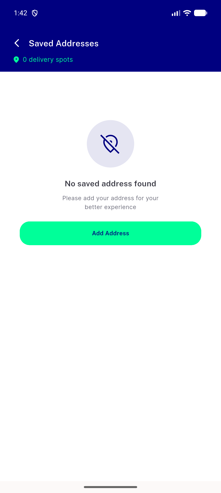
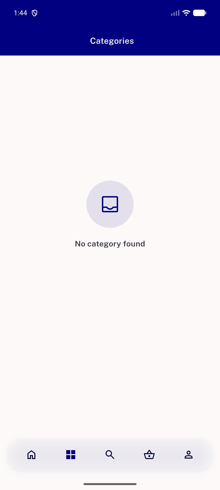

# QA Evidence — NEARS-2903

**PASS - NoDataScreen callsite judgment: AC2 2 wire sites verified (code+widget-test), AC3 2/3 leave-sites live, AC4 code-confirmed**

**2 screenshot(s).** Click any thumbnail for full resolution.

<table>
<tr>
<td align="center" width="33%"> ac3 access location no address noaction</td>
<td align="center" width="33%"> ac3 category screen no category found</td>
</tr>
</table>

### Other artifacts
- [`ac3-access-location-dump.xml`](ac3-access-location-dump.xml)
- [`ac3-category-screen-no-category-found-dump.xml`](ac3-category-screen-no-category-found-dump.xml)

---
*From `nears/docs/qa-evidence/NEARS-2903/` · public-repo scrub policy (no live secrets; verified clean).*
