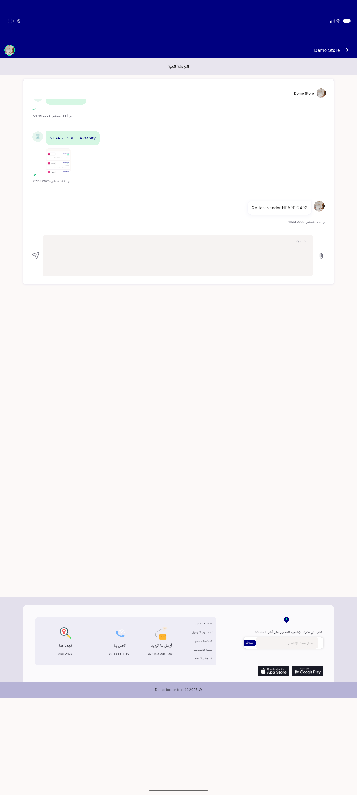
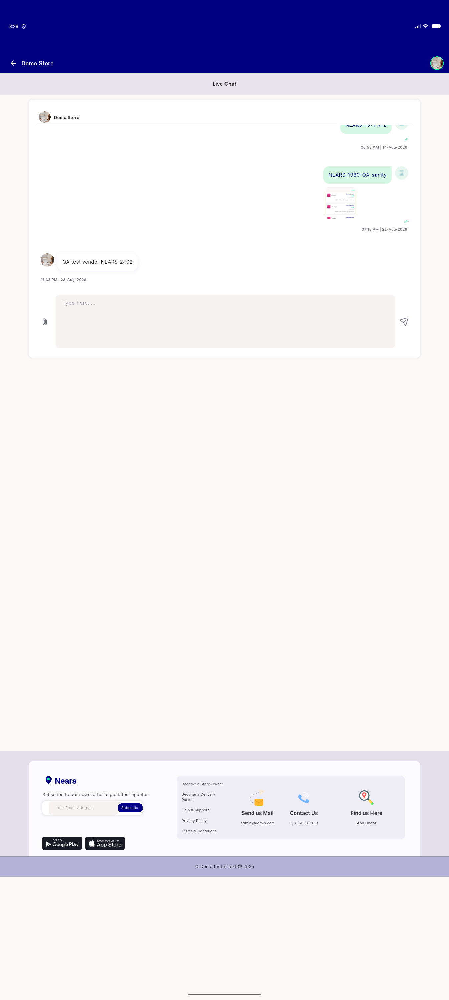

# QA Evidence — NEARS-2905

**PASS - chat attach-icon EdgeInsetsDirectional fix verified LTR+RTL, zero visual delta as expected**

**2 screenshot(s).** Click any thumbnail for full resolution.

<table>
<tr>
<td align="center" width="33%"> nears2905 attach icon ar desktop</td>
<td align="center" width="33%"> nears2905 attach icon en desktop</td>
</tr>
</table>

---
*From `nears/docs/qa-evidence/NEARS-2905/` · public-repo scrub policy (no live secrets; verified clean).*
