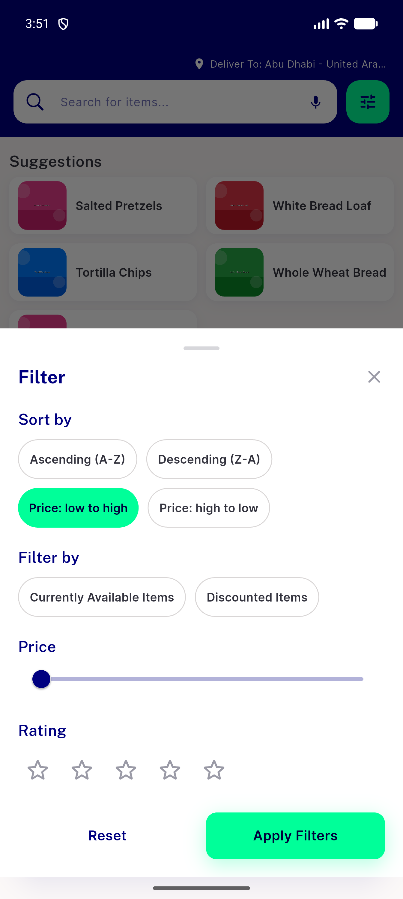
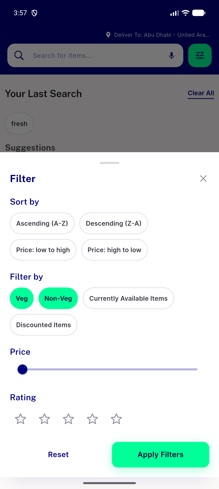
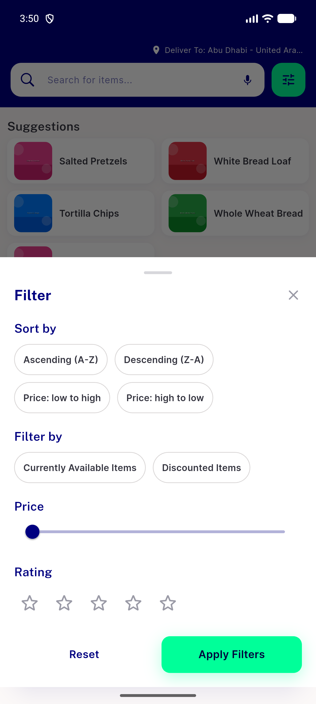

# QA Evidence — NEARS-2909

**PASS — NFilterChip migration verified live, all ACs demonstrated**

**4 screenshot(s).** Click any thumbnail for full resolution.

<table>
<tr>
<td align="center" width="33%"> ac1 ac2 sort selected item</td>
<td align="center" width="33%"> ac1 veg nonveg selected</td>
<td align="center" width="33%"> ac2 filter sheet item idle</td>
</tr>
<tr>
<td align="center" width="33%"> regression rtl filter sheet</td>
</tr>
</table>

### Other artifacts
- [`ac3-a11y-selected-dump.xml`](ac3-a11y-selected-dump.xml)

---
*From `nears/docs/qa-evidence/NEARS-2909/` · public-repo scrub policy (no live secrets; verified clean).*
