# QA Evidence — NEARS-291

**11 screenshot(s).** Click any thumbnail for full resolution.

<table>
<tr>
<td align="center" width="33%"><a href="01-home-baqala-zone391.png">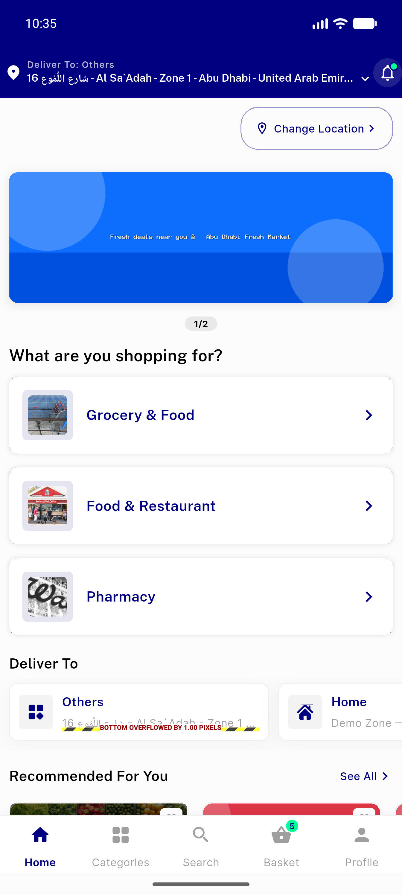</a> home baqala zone391</td>
<td align="center" width="33%"><a href="02-search-baqala-store-result.png">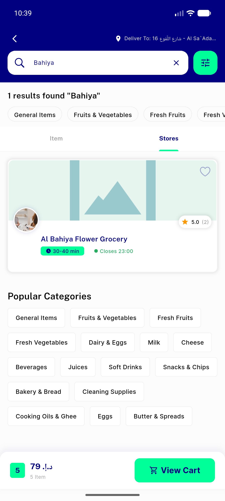</a> search baqala store result</td>
<td align="center" width="33%"><a href="03-baqala-store-detail-items.png">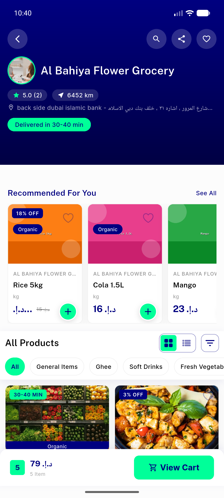</a> baqala store detail items</td>
</tr>
<tr>
<td align="center" width="33%"><a href="04-cart-baqala-items.png">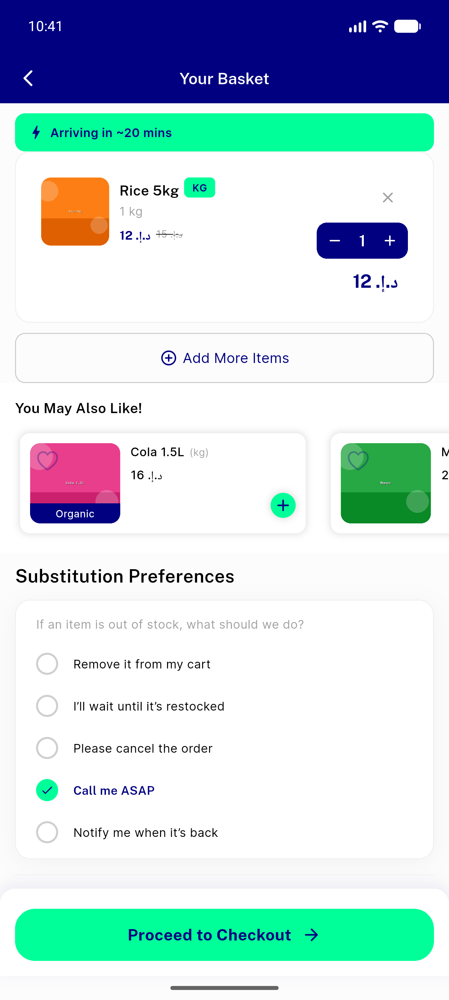</a> cart baqala items</td>
<td align="center" width="33%"><a href="05-checkout-baqala-order.png">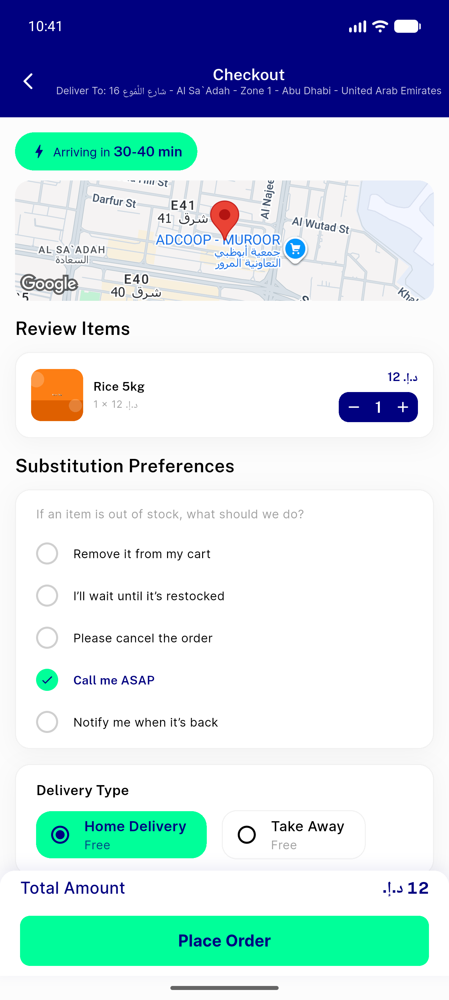</a> checkout baqala order</td>
<td align="center" width="33%"><a href="06-d11-unzoned-store-absent.png">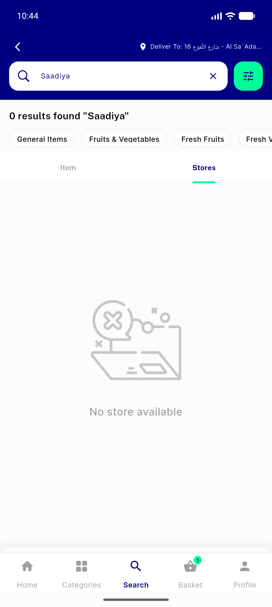</a> d11 unzoned store absent</td>
</tr>
<tr>
<td align="center" width="33%"><a href="all_stores_view.png">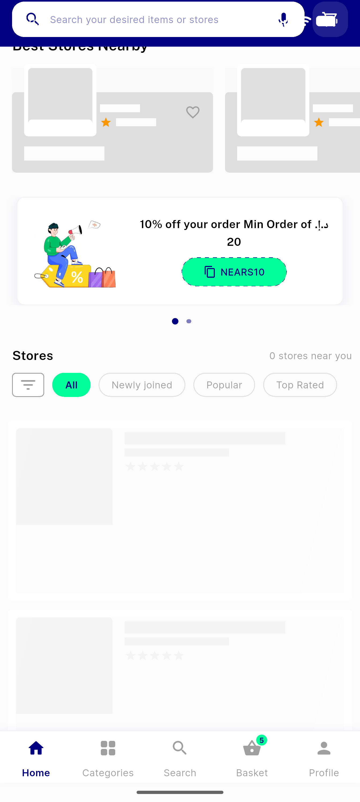</a> all stores view</td>
<td align="center" width="33%"><a href="baqala_location.png">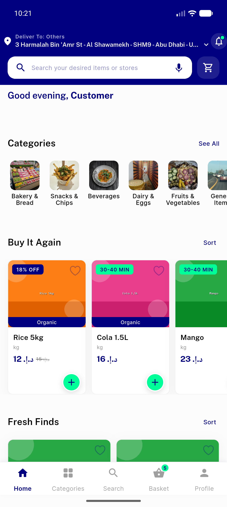</a> baqala location</td>
<td align="center" width="33%"><a href="demo_zone_stores.png">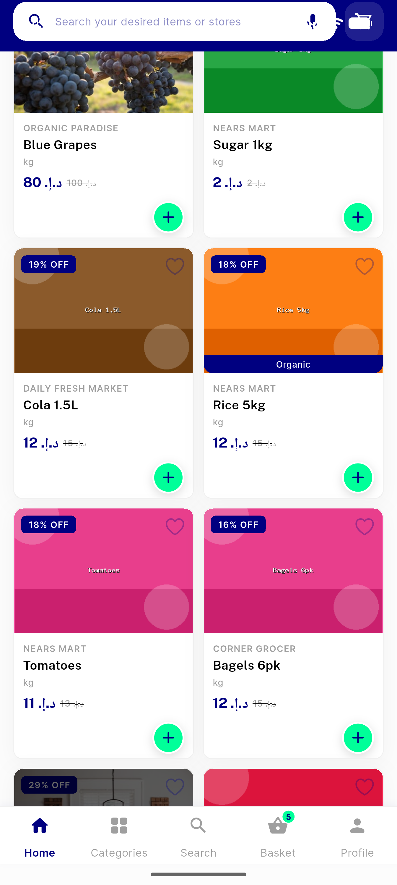</a> demo zone stores</td>
</tr>
<tr>
<td align="center" width="33%"><a href="store_detail_attempt.png">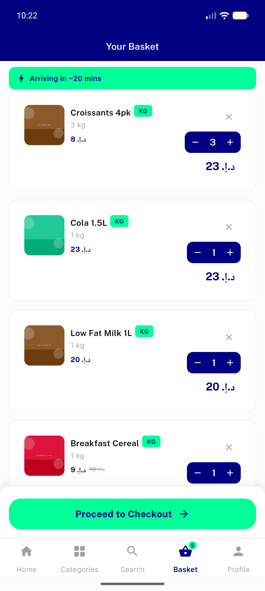</a> store detail attempt</td>
<td align="center" width="33%"><a href="zero_stores_near_you.png">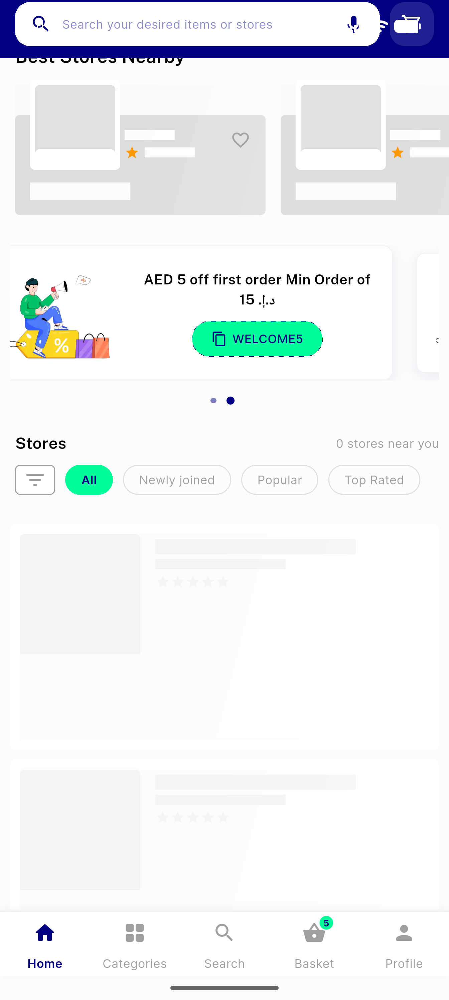</a> zero stores near you</td>
</tr>
</table>

---
*From `nears/docs/qa-evidence/NEARS-291/` · public-repo scrub policy (no live secrets; verified clean).*
