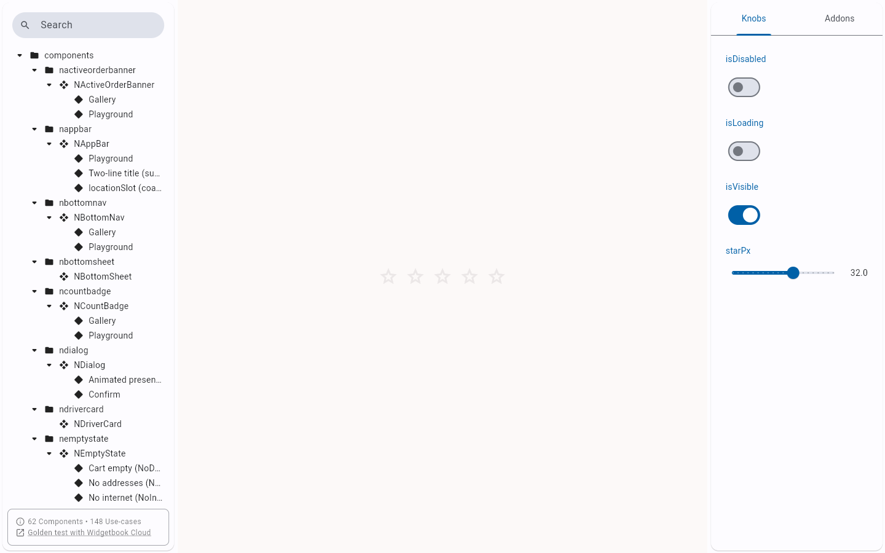
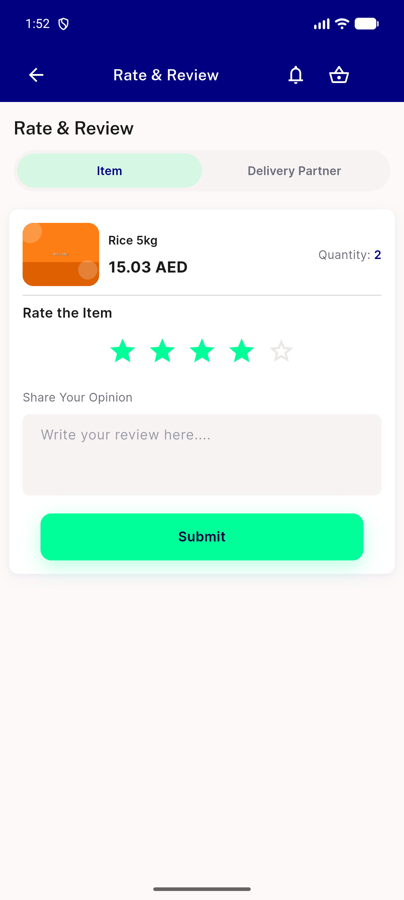
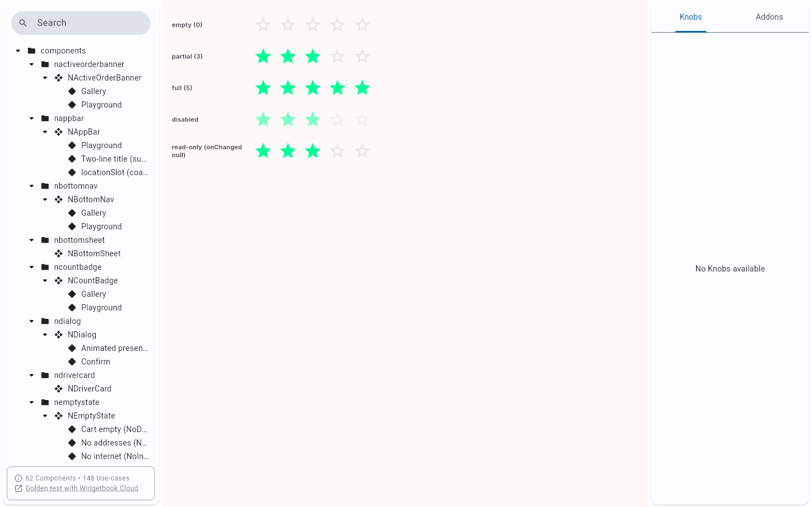

# QA Evidence — NEARS-2910

**PASS -- NRatingInput DLS element + UserApp review migration, live AND/RTL verified**

**3 screenshot(s).** Click any thumbnail for full resolution.

<table>
<tr>
<td align="center" width="33%"> ac1 widgetbook rtl playground</td>
<td align="center" width="33%"> ac3 item review star4 tapped live</td>
<td align="center" width="33%"> ac5 widgetbook gallery states</td>
</tr>
</table>

---
*From `nears/docs/qa-evidence/NEARS-2910/` · public-repo scrub policy (no live secrets; verified clean).*
