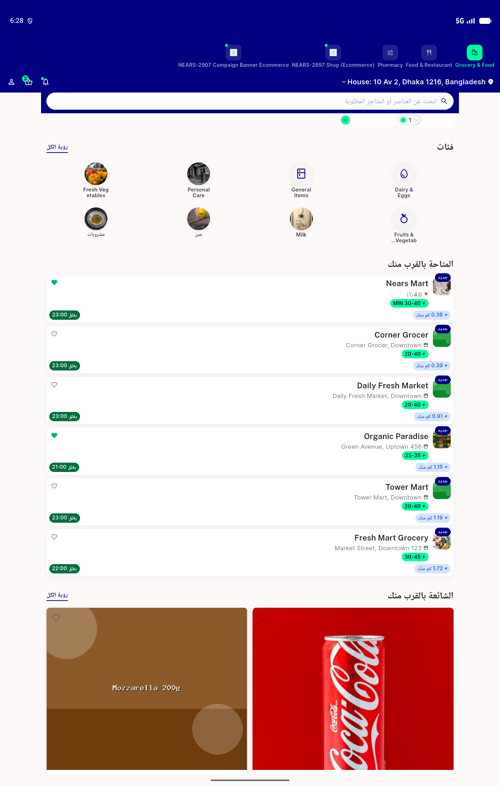
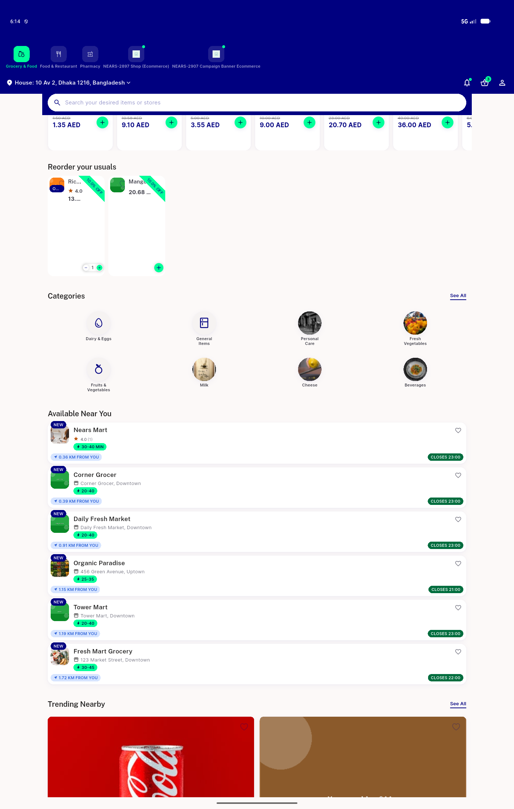

# QA Evidence — NEARS-2912

**QA PASS -- pillWidth trim closes residual overflow; live EN 2.0x + AR/RTL 1.3x verified**

**2 screenshot(s).** Click any thumbnail for full resolution.

<table>
<tr>
<td align="center" width="33%"> ac1 live desktop narrow incart rated ar rtl 1.3x</td>
<td align="center" width="33%"> ac1 live desktop narrow incart rated</td>
</tr>
</table>

---
*From `nears/docs/qa-evidence/NEARS-2912/` · public-repo scrub policy (no live secrets; verified clean).*
