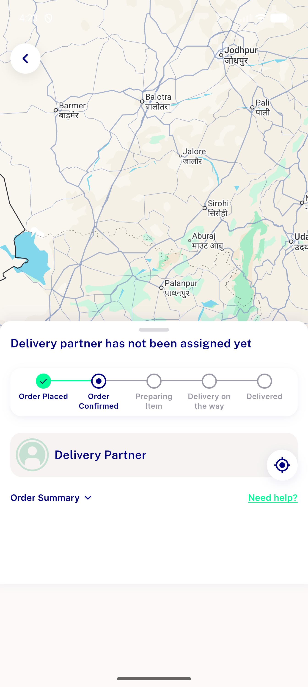

# QA Evidence — NEARS-2916

**QA-lite: AC3 verified live (FAB normal-state regression clean); AC1/AC2 environment-blocked, see comment**

**1 screenshot(s).** Click any thumbnail for full resolution.

<table>
<tr>
<td align="center" width="33%"> ac3 fab normal state</td>
</tr>
</table>

---
*From `nears/docs/qa-evidence/NEARS-2916/` · public-repo scrub policy (no live secrets; verified clean).*
