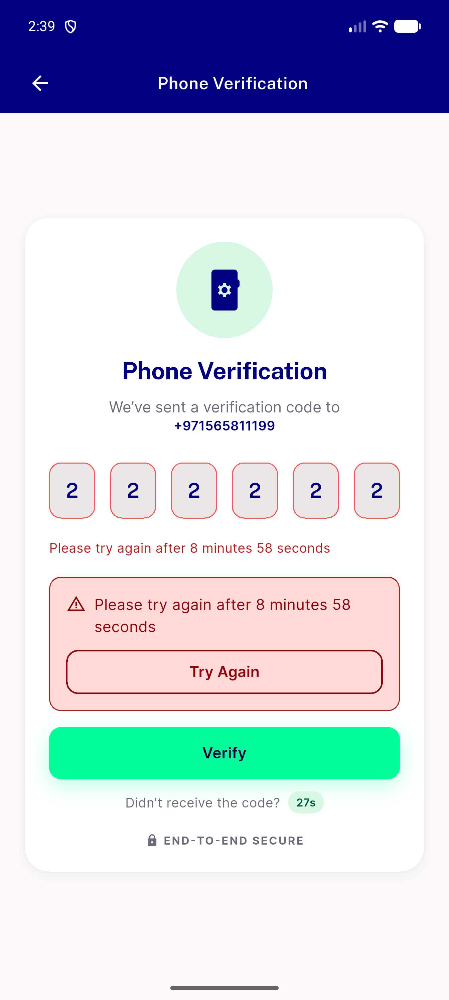
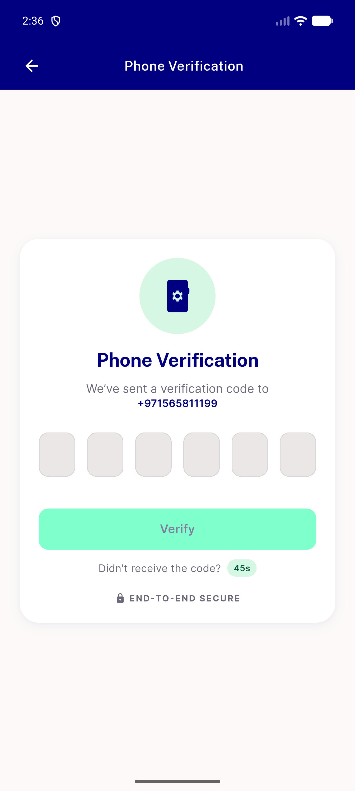
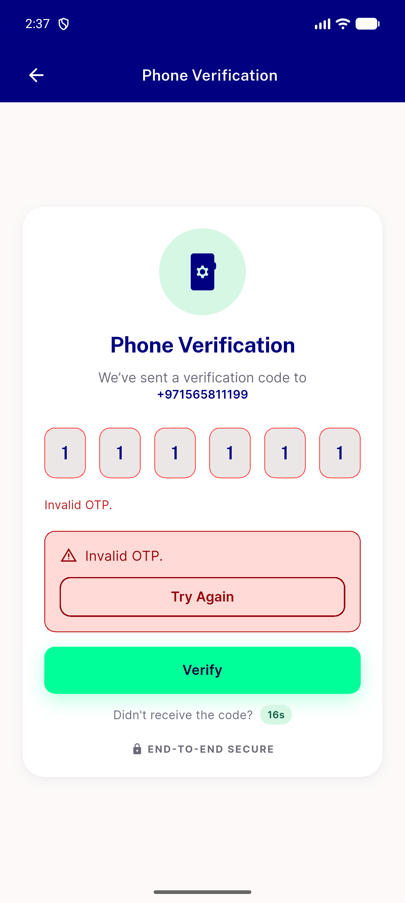

# QA Evidence — NEARS-2918

**PASS - AC1 static grep 0 hits, AC2 live wrong-OTP shake confirmed on emulator-5556, regression sweep clean (back-during-flight, re-entry, double wrong-OTP), automated backstop 25/25 + dispose test pass**

**3 screenshot(s).** Click any thumbnail for full resolution.

<table>
<tr>
<td align="center" width="33%"> ac2 reentry shake retrigger</td>
<td align="center" width="33%"> ac2 verification screen baseline</td>
<td align="center" width="33%"> ac2 wrong otp shake</td>
</tr>
</table>

---
*From `nears/docs/qa-evidence/NEARS-2918/` · public-repo scrub policy (no live secrets; verified clean).*
