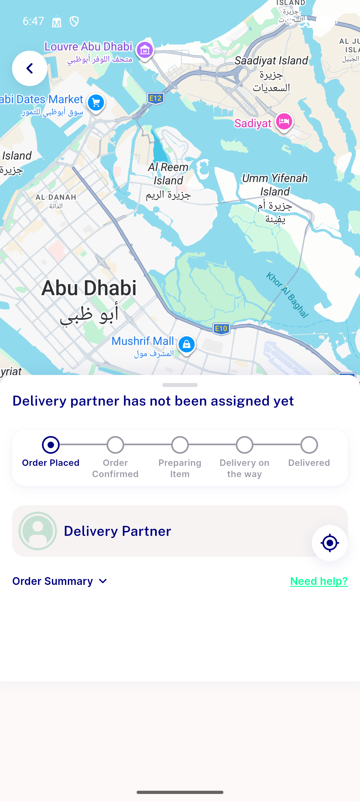

# QA Evidence — NEARS-2924

**PASS - free_delivery coupon min_purchase server-side enforcement verified live (a-h)**

**1 screenshot(s).** Click any thumbnail for full resolution.

<table>
<tr>
<td align="center" width="33%"> ac d userapp checkout eligible free delivery</td>
</tr>
</table>

### Other artifacts
- [`bug-fcm-push-notification-failure.log`](bug-fcm-push-notification-failure.log)

---
*From `nears/docs/qa-evidence/NEARS-2924/` · public-repo scrub policy (no live secrets; verified clean).*
