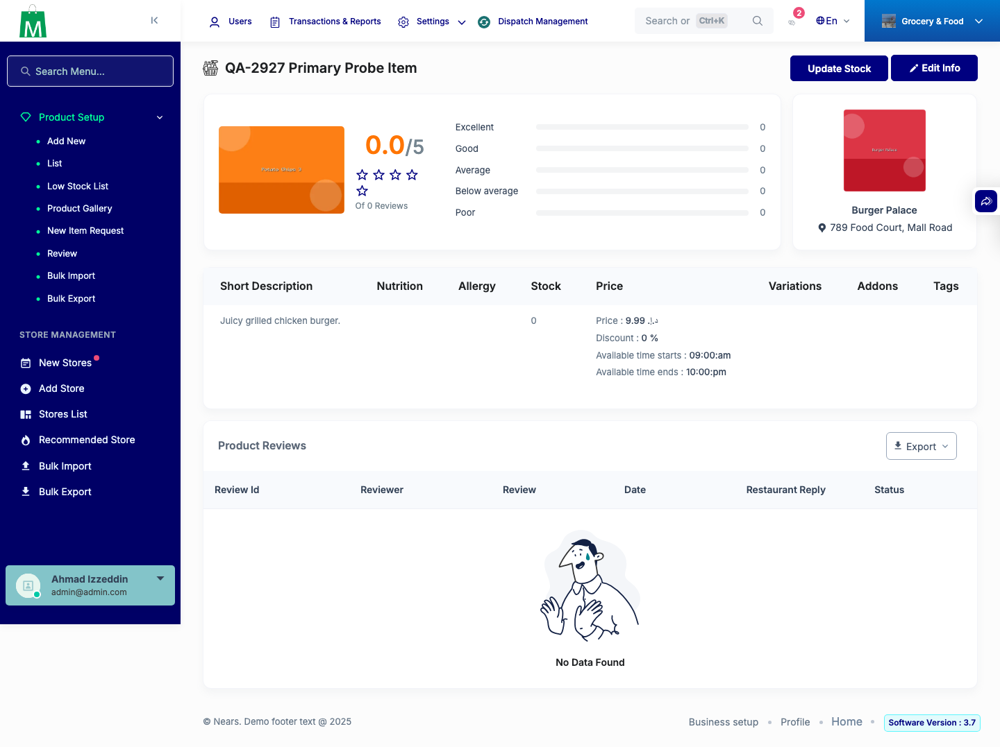
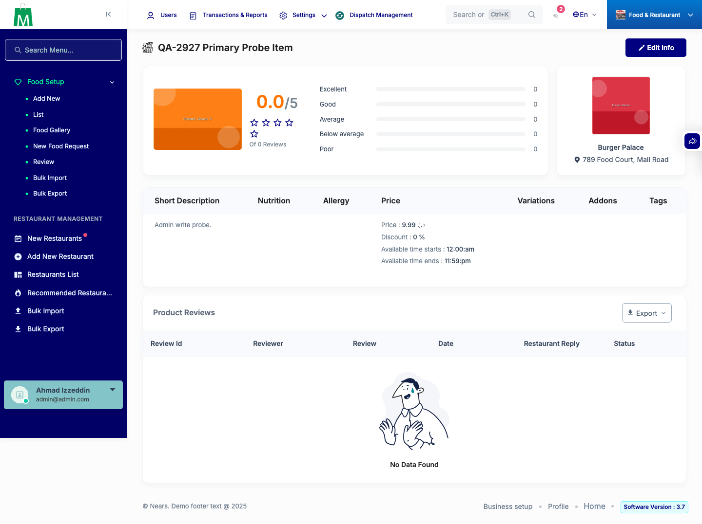
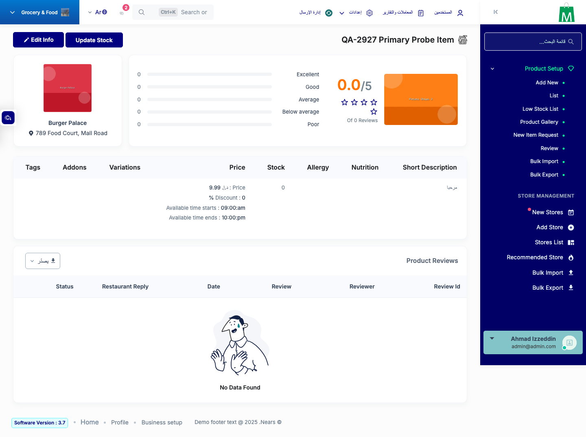
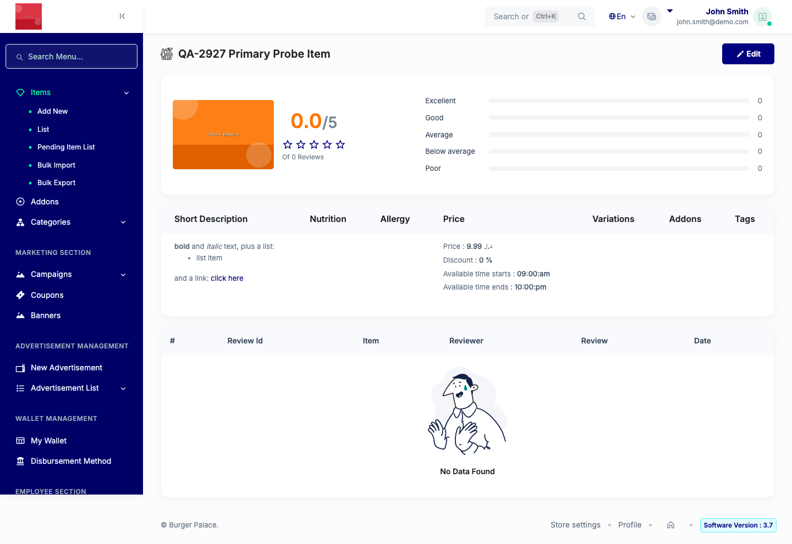
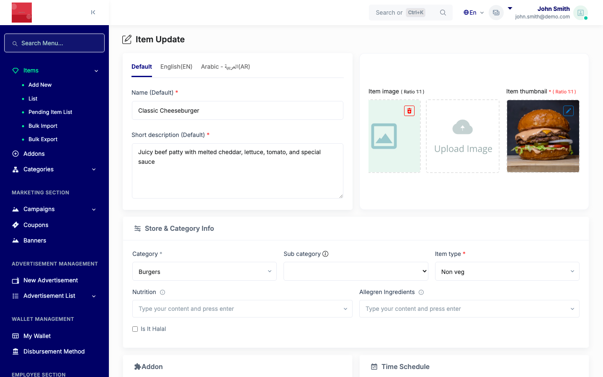

# QA Evidence — NEARS-2927

**PASS - stored XSS sanitize verified across vendor/admin write+bulk-import+non-default-locale, negative control clean**

**9 screenshot(s).** Click any thumbnail for full resolution.

<table>
<tr>
<td align="center" width="33%"> ac1 admin item view</td>
<td align="center" width="33%"> ac2 vendor bulk import</td>
<td align="center" width="33%"> ac3 admin panel write</td>
</tr>
<tr>
<td align="center" width="33%"> ac4 admin bulk import</td>
<td align="center" width="33%"> ac5 admin item view arabic</td>
<td align="center" width="33%"> ac6 admin negative control</td>
</tr>
<tr>
<td align="center" width="33%"> ac7 vendor item view</td>
<td align="center" width="33%"> bug null review order id 500</td>
<td align="center" width="33%"> bug variation min zero required deadlock</td>
</tr>
</table>

### Other artifacts
- [`bug-null-review-order-id-500.log`](bug-null-review-order-id-500.log)
- [`bug-translations-shadow-stale-after-bulk-import.log`](bug-translations-shadow-stale-after-bulk-import.log)
- [`bug-variation-min-zero-required-deadlock.log`](bug-variation-min-zero-required-deadlock.log)

---
*From `nears/docs/qa-evidence/NEARS-2927/` · public-repo scrub policy (no live secrets; verified clean).*
